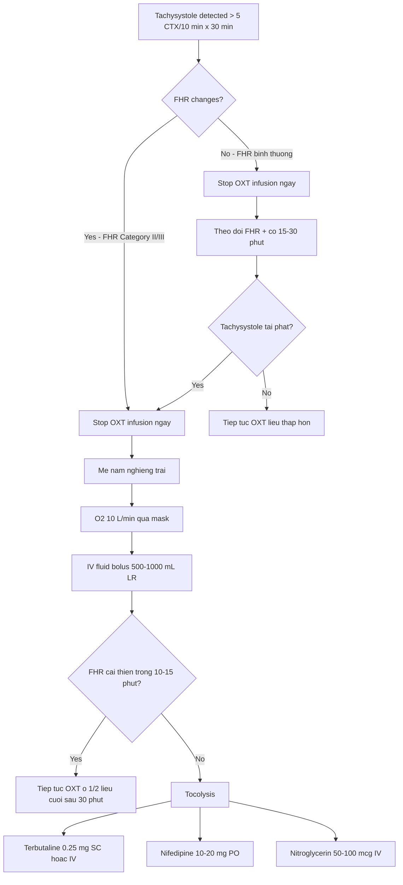
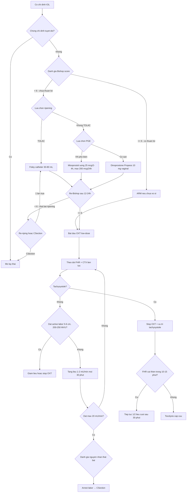

# Đẻ Chỉ Huy Bằng Oxytocin — Guideline Hiện Hành và Bằng Chứng Lâm Sàng

> **Ngày soạn:** 2026-06-23
> **Loại tài liệu:** Guideline + clinical evidence synthesis (Sản khoa)
> **Phạm vi:** Induction of labor (IOL) bằng oxytocin tĩnh mạch — protocol, monitoring, xử trí biến chứng, đặc biệt IOL trên sẹo mổ cũ (TOLAC).
> **Tài liệu đi kèm:** `Oxytocin_Mechanism_2026-06-23.md` (cơ chế phân tử)
> **Từ khoá chính:** Induction of labor, oxytocin titration, low-dose vs high-dose, tachysystole, uterine rupture, TOLAC, VBAC, cervical ripening

---

## Mục lục

1. [Bối cảnh và định nghĩa](#1-bối-cảnh-và-định-nghĩa)
2. [Guideline hiện hành](#2-guideline-hiện-hành)
3. [Chỉ định khởi phát chuyển dạ](#3-chỉ-định-khởi-phát-chuyển-dạ)
4. [Chống chỉ định và thận trọng](#4-chống-chỉ-định-và-thận-trọng)
5. [Đánh giá cổ tử cung trước IOL — Bishop Score](#5-đánh-giá-cổ-tử-cung-trước-iol--bishop-score)
6. [Hai chiến lược: Cervical ripening vs Direct oxytocin](#6-hai-chiến-lược-cervical-ripening-vs-direct-oxytocin)
7. [Phác đồ oxytocin — Low-dose vs High-dose](#7-phác-đồ-oxytocin--low-dose-vs-high-dose)
8. [Theo dõi (monitoring)](#8-theo-dõi-monitoring)
9. [Tachysystole — định nghĩa, hậu quả, xử trí](#9-tachysystole--định-nghĩa-hậu-quả-xử-trí)
10. [Oxytocin trên sẹo mổ cũ — VBAC/TOLAC](#10-oxytocin-trên-sẹo-mổ-cũ--vbactolac)
11. [So sánh oxytocin với các phương pháp khác](#11-so-sánh-oxytocin-với-các-phương-pháp-khác)
12. [Kết hợp ripening + oxytocin (sequential)](#12-kết-hợp-ripening--oxytocin-sequential)
13. [Áp dụng tại Việt Nam — BYT và thực hành](#13-áp-dụng-tại-việt-nam--byt-và-thực-hành)
14. [Tóm tắt và cheat sheet](#14-tóm-tắt-và-cheat-sheet)
15. [Tài liệu tham khảo](#15-tài-liệu-tham-khảo)

---

## 1. Bối cảnh và định nghĩa

### 1.1. Khởi phát chuyển dạ (Induction of labor, IOL) là gì

- **Định nghĩa (ACOG/SMFM Consensus 2014):** IOL là **can thiệp y khoa nhằm khởi phát chuyển dạ** (bằng cơn co tử cung tự nhiên) trước khi cơn co tự xuất hiện, với mục tiêu sinh qua đường âm đạo.
- **Khác với augmentation** (tăng cường cơn co) — augmentation áp dụng khi cơn co đã bắt đầu nhưng **yếu/không đủ** để tiến triển; IOL thì cổ tử cung thường **chưa xoá** và **chưa có cơn co đều**.
- **Tỷ lệ IOL tăng mạnh trên toàn cầu:** Tại Mỹ, IOL từ ~9.5% năm 1990 tăng lên **~32% năm 2021** (ACOG data). Tại các bệnh viện sản lớn ở VN hiện nay phổ biến 20–35% tuỳ cơ sở.

### 1.2. Vai trò của oxytocin trong IOL

- **Oxytocin** (synthetic OXT) là một trong hai trụ cột chính của IOL, bên cạnh **cervical ripening** (chín muồi cổ tử cung).
- Oxytocin có thể dùng:
  - **Đơn thuần** khi cổ tử cung đã thuận lợi (Bishop ≥ 6, có thể ≥ 8 ở nulliparous).
  - **Sau cervical ripening** (Foley/mechanical hoặc prostaglandin) khi cổ tử cung chưa thuận lợi.
  - **Augmentation** trong chuyển dạ kéo dài / cơn co không đủ (cùng protocol nhưng bắt đầu ở liều thấp hơn).

### 1.3. Tại sao bài này quan trọng

- IOL là **một trong những can thiệp phổ biến nhất** trong sản khoa hiện đại.
- Tỷ lệ biến chứng (tachysystole, thai suy, vỡ tử cung trên sẹo cũ) liên quan trực tiếp đến **protocol**, **monitoring**, và **khả năng xử trí** của team.
- Hiểu rõ **cơ chế** (đã trình bày trong file `Oxytocin_Mechanism_2026-06-23.md`) giúp bác sĩ **titrated liều hợp lý** thay vì dùng "cố định" một mức.

---

## 2. Guideline hiện hành

### 2.1. Bảng guideline chính

| Tổ chức | Tên tài liệu | Mã số | Năm | Tình trạng |
|----------|--------------|-------|-----|-----------|
| **ACOG** | Practice Bulletin: Induction of Labor | **#107** (2009) → thay thế bởi các PB khác (#204 chorioamnionitis 2019; #175 cervical ripening 2016); update guideline #204 + OB Consensus 2014 + 2024 update | 2009 → cập nhật rải rác | Active |
| **ACOG + SMFM** | Consensus: Safe Prevention of the Primary Cesarean Delivery | Consensus Obstetric Care Series #1 | 2014 (reaffirmed 2019) | Active — chi tiết oxytocin dosing |
| **RCOG** | Green-top Guideline: Induction of Labour | **No. 45** (active management); còn có GTG 35 (stillbirth) + GTG 73 (VBAC) | 2001 → cập nhật 2024 | Active |
| **NICE** | Inducing Labour | **NG207** | 2021 (cập nhật gần nhất 2023) | Active |
| **WHO** | WHO Recommendations for Induction of Labour | WHO/RHR/11.10 | 2011 (update 2022 đang thực hiện) | Active |
| **FIGO** | FIGO Safe Motherhood & Newborn Health Committee — Recommendations on Induction of Labour | FIGO SMNH 2022 | 2022 | Active |
| **BV Bộ Y tế VN** | Hướng dẫn quốc gia về các dịch vụ chăm sóc sức khỏe sinh sản (phần Khởi phát chuyển dạ) | BYT 2016 + update cục BV | 2016 → cập nhật 2024 | Active tại VN |

### 2.2. Điểm chung giữa các guideline

- **Low-dose titrated protocol** là **khuyến cáo đầu tay** (ACOG, RCOG, NICE, WHO đồng thuận) cho IOL đủ thai ≥ 37 tuần không có yếu tố nguy cơ.
- **Cần monitoring liên tục** (tocodynamometer + FHR) khi truyền oxytocin.
- **Tachysystole management:** ngừng truyền + reposition + IV fluid + tocolysis nếu FHR không cải thiện.
- **VBAC/TOLAC:** oxytocin **được phép** nhưng với **thận trọng** — escalation interval ≥ 30 phút, max dose ≤ 20 mU/min, theo dõi sát.

### 2.3. Điểm khác biệt đáng chú ý

| Vấn đề | ACOG | RCOG | NICE NG207 | WHO | VN (BYT) |
|---------|------|------|-----------|-----|----------|
| **Khởi đầu OXT** | 0.5–2 mU/min | 1–4 mU/min (low-dose); 4 mU/min cho active IOL | 1–4 mU/min | 1–2 mU/min | 2–4 mU/min (phổ biến 2 mU/min) |
| **Tăng liều** | +1–2 mU/min / 15–40 min | +1–4 mU/min / 30 min (low-dose); +4 mU/min / 15–20 min (high-dose) | +1–4 mU/min / 30 min | +1 mU/min / 30 min | +1–2 mU/min / 30 min |
| **Max dose** | Không cố định (dựa vào đáp ứng) | 20 mU/min | 20 mU/min | Khuyến cáo giới hạn (không cố định) | 20 mU/min |
| **Active management** | ACOG/SMFM 2014 khuyến cáo | RCOG GTG 45 | NICE NG207 | — | BYT 2016 |
| **VBAC max dose** | Khuyến cáo < 20 mU/min, ≥ 30 min interval | < 20 mU/min | < 20 mU/min | Khuyến cáo < 20 mU/min | Theo guideline chung |

> **Ghi chú:** Số liệu cụ thể (interval, max dose) được hỗ trợ bởi **Nicolò P et al. 2026** meta-analysis (`AJOG MFM`, PMID 41241095) — kết quả phân tích 21 nghiên cứu, 51.511 bệnh nhân TOLAC cho thấy interval < 30 phút và max dose > 20 mU/min liên quan tăng nguy cơ vỡ tử cung. `[FULL VERIFIED]`

---

## 3. Chỉ định khởi phát chuyển dạ

### 3.1. Chỉ định thường gặp

| Nhóm | Chỉ định cụ thể | Bằng chứng |
|------|----------------|------------|
| **Thai quá ngày (post-term)** | ≥ 41 tuần (ACOG); ≥ 41+0 theo NICE; FIGO 2022 khuyến cáo 39–40 tuần | Cochrane 2018 + ACOG PB |
| **PROM đủ thai** | ≥ 37 tuần, không chuyển dạ trong 24 giờ (ACOG: 12–24 giờ; NICE: 24 giờ) | ACOG #204 + Cochrane |
| **Đái tháo đường thai kỳ** | DM type 2 hoặc GDM kiểm soát kém; khuyến cáo IOL 38–39 tuần | FIGO 2022 + ACOG |
| **Tăng huyết áp / tiền sản giật** | Tùy mức nặng; thường 37 tuần trở lên | ACOG + WHO |
| **IUGR / thai chậm tăng trưởng** | ≥ 37 tuần hoặc sớm hơn tùy tình trạng | RCOG GTG 31 + ACOG |
| **Oligohydramnios đơn độc** | ≥ 36–37 tuần | ACOG |
| **Đa ối nặng có triệu chứng** | ≥ 37 tuần | ACOG |
| **Thai lưu (stillbirth)** | Bất kỳ tuổi thai nào | WHO + ACOG |
| **Nguy cơ thuyên tắc ối** | Đa sản, thai to, IOL chủ động 39 tuần | ACOG/SMFM 2014 |
| **Mẹ có bệnh lý nội khoa** | SLE, thận, tim (giai đoạn ổn định) | ACOG + chuyên khoa |
| **Yêu cầu mẹ / lý do xã hội** | Sau 39 tuần (ACOG/SMFM); WHO không khuyến cáo < 39 tuần vì lý do xã hội | ACOG + WHO |

### 3.2. Chỉ định mới nổi (emerging)

- **Tuổi mẹ ≥ 35** với thai kỳ bình thường: ACOG 2013 không khuyến cáo IOL thường quy < 39 tuần.
- **Béo phì (BMI ≥ 35)** với thai kỳ bình thường: ACOG/SMFM 2014 cân nhắc IOL 39 tuần ở một số ca.

---

## 4. Chống chỉ định và thận trọng

### 4.1. Chống chỉ định tuyệt đối (cũng là chống chỉ định sinh ngả âm đạo)

- **Nhau tiền đạo (placenta previa)** che phủ lỗ trong CTC.
- **Vasa previa.**
- **Ngôi bất thường** (ngôi ngang, ngôi mông — ngoại trừ mông đã chọn sinh ngả âm đạo).
- **Dây rốn sa trước (cord prolapse)** hoặc nghi ngờ.
- **Sẹo mổ cũ xuyên thân tử cung:** mổ cổ điển (classical C-section), mổ T-incision, mổ ngang dọc, mổ myomectomy xuyên thân tử cung (cá nhân hoá).
- **Nhiễm HSV đang hoạt động** có tổn thương.
- **Carcinoma cổ tử cung xâm lấn.**
- **Bất tương xứng đầu-chậu (CPD)** rõ ràng.
- **Vỡ tử cung trước đó.**

### 4.2. Chống chỉ định tương đối / cần thận trọng

| Tình huống | Hướng xử trí |
|------------|-------------|
| **Sẹo mổ ngang thân tử cung (low transverse)** — TOLAC | Có thể IOL, nhưng **giảm liều** OXT, interval ≥ 30 min, max ≤ 20 mU/min (Nicol 2026 PMID 41241095) |
| **Đa thai** | Cho phép IOL, nhưng cần monitoring từng thai; hiếm khi cần OXT nhiều |
| **Nước ối nhiều (polyhydramnios)** | Nguy cơ vỡ ối đột ngột, sa dây rốn; cần chuẩn bị |
| **FGR / thai suy** | Cho phép IOL nhưng **titrated chậm**, sẵn sàng mổ cấp cứu |
| **Béo phì nặng** | Liều OXT có thể cần cao hơn; cân nhắc IV access tốt |
| **Tiền sử tachysystole / mẫn cảm OXT** | Khởi đầu rất thấp (0.5 mU/min); tăng chậm |

---

## 5. Đánh giá cổ tử cung trước IOL — Bishop Score

### 5.1. Bishop Score là gì

Bishop score là hệ thống điểm đánh giá **sự "thuận lợi"** của cổ tử cung để dự đoán khả năng thành công IOL.

| Tiêu chí | 0 | 1 | 2 | 3 |
|----------|---|---|---|---|
| **Độ xoá (effacement %)** | 0–30% | 40–50% | 60–70% | ≥ 80% |
| **Độ mở (dilation cm)** | đóng | 1–2 | 3–4 | ≥ 5 |
| **Vị trí (position)** | posterior | mid | anterior | — |
| **Mật độ (consistency)** | cứng | trung bình | mềm | — |
| **Ngôi (station, so mỏ vịt)** | -3 | -2 | -1 / 0 | dưới mỏ vịt |

- **Tổng điểm:**
  - **≥ 6:** cổ tử cung thuận lợi → có thể IOL trực tiếp bằng OXT (amniotomy + OXT).
  - **< 6:** cổ tử cung chưa thuận lợi → **cần cervical ripening trước** (Foley / prostaglandin).

### 5.2. Lưu ý lâm sàng

- Bishop score có **độ chủ quan cao** (inter-observer variability).
- Điểm **≥ 6 ở nulliparous** có thể cần cao hơn (≥ 8) để dự đoán thành công.
- **Modified Bishop score** có thêm yếu tố parità, làm tăng giá trị tiên đoán.
- Nên **đánh giá lại** sau khi ripening để quyết định bắt đầu OXT.

---

## 6. Hai chiến lược: Cervical ripening vs Direct oxytocin

### 6.1. Cervical ripening (chín muồi cổ tử cung) trước OXT

Áp dụng khi **Bishop < 6**. Mục tiêu: làm mềm, xoá, mở cổ tử cung về **Bishop ≥ 6** trước khi truyền OXT.

| Nhóm | Phương pháp | Cơ chế | Ưu điểm | Nhược điểm |
|------|------------|--------|----------|------------|
| **Cơ học (mechanical)** | Foley catheter 16–18 Fr (đặt qua CTC, bóng 30–80 mL), double-balloon (Cook) | Áp lực cơ học → giải phóng PGE2 nội sinh → ripening | An toàn, rẻ, không có tachysystole do thuốc | Thời gian ripening lâu (6–12 giờ), khó chịu cho mẹ |
| **Prostaglandin E1 (PGE1)** | Misoprostol 25–50 mcg đặt âm đạo hoặc uống (BYT VN hay dùng uống 25 mcg mỗi 2–4 giờ, max 200 mcg/24 giờ) | Tăng PGE1 → tăng Ca²⁺, giảm collagen → ripening | Hiệu quả cao, nhanh, rẻ | Tachysystole cao hơn (nhưng Pieux 2025 PMID 40097030 cho thấy **uống** ít hơn dinoprostone 17.2% → 5.3%) |
| **Prostaglandin E2 (PGE2)** | Dinoprostone (Propess 10 mg vaginal insert; Cervidil; Prepidil gel 0.5 mg) | PGE2 ổn định hơn PGE1; tác dụng ripening + nhẹ co | Ít tachysystole hơn PGE1 liều cao; kiểm soát được (Propess tháo ra khi cần) | Giá cao hơn misoprostol; cần bảo quản lạnh (Propess) |
| **Tách ối (membrane sweeping)** | Vuốt màng ối qua CTC từ 38–39 tuần | Giải phóng PGF2α nội sinh | Không thuốc, có thể làm tại phòng khám | Ít hiệu quả; gây khó chịu |

### 6.2. Direct oxytocin (bắt đầu OXT ngay)

Áp dụng khi **Bishop ≥ 6** (thường ≥ 7–8 ở nulliparous). Một số phác đồ còn phối hợp **amniotomy** (ARM — Artificial Rupture of Membranes) trước hoặc sau khi bắt đầu OXT.

---

## 7. Phác đồ oxytocin — Low-dose vs High-dose

### 7.1. Bảng so sánh hai protocol

| Thông số | **Low-dose** (ACOG + WHO khuyến cáo) | **High-dose** (RCOG; một số châu Âu + Kruit Helsinki 2022) |
|----------|--------------------------------------|------------------------------------------------------------|
| **Khởi đầu** | 0.5–2 mU/min (phổ biến **1–2**) | 4–6 mU/min |
| **Bước tăng** | +1–2 mU/min | +4–6 mU/min |
| **Interval** | 30–40 phút (một số 15–30) | 15–20 phút |
| **Max dose** | 20 mU/min (không cố định; dựa đáp ứng) | 20 mU/min |
| **Thời gian đạt active labor** | **~6–8 giờ** | **~3–4 giờ** |
| **Tần suất tachysystole** | ~5% | ~10–15% |
| **Tỷ lệ cesarean** | Tương đương | Tương đương |
| **PPH (postpartum hemorrhage)** | Có thể cao hơn (Grasch 2025: 9.9% vs 7.6%) | Có thể thấp hơn |
| **Vaginal delivery rate** | Tương đương | Kruit 2022: 69.9% vs 47.9% |
| **An toàn thai nhi** | Được ưa chuộng vì ít tachysystole | Cần monitoring chặt hơn |

### 7.2. Bằng chứng meta-analysis mới nhất — Grasch 2025

**Grasch JL et al. 2025** (`Am J Obstet Gynecol MFM`, PMID **40334983**) — systematic review + meta-analysis so sánh high-dose vs low-dose:

- **6 nghiên cứu** (2 RCT + 4 observational), **7,850 ca** (3,957 high-dose + 3,893 low-dose).
- **Cesarean delivery:** **không khác biệt** giữa hai nhóm (26.0% vs 28.4%; pooled RR **1.02, 95% CI 0.85–1.21**).
- **Postpartum hemorrhage:** high-dose **thấp hơn** (7.6% vs 9.9%; RR **0.78, 95% CI 0.66–0.92**).
- **Thời gian chuyển dạ:** không khác biệt.
- **Cesarean vì thai suy / neonatal morbidity:** không khác biệt.
- **Tác giả kết luận:** không có sự khác biệt rõ ràng về tỷ lệ cesarean; **cần thêm RCT chất lượng cao** để xác định protocol tối ưu.

> `[FULL VERIFIED]` — abstract từ PubMed E-utilities (đã verify ngày 2026-06-23).

### 7.3. Bằng chứng đơn trung tâm — Kruit 2022 (Helsinki)

**Kruit H et al. 2022** (`PLoS One`, PMID **35452451**) — retrospective observational, 487 women tại Helsinki University Hospital:

- Sau khi chuyển từ low-dose sang high-dose protocol, **tỷ lệ vaginal delivery tăng từ 47.9% → 69.9%** (p < 0.004).
- **Maternal infection** giảm 22.1% → 13.6% (p = 0.02); **neonatal infection** giảm 14.6% → 2.9% (p < 0.001).
- **Induction-to-delivery interval:** high-dose ngắn hơn (32.0 giờ vs 37.9 giờ, p < 0.001).
- Tác giả đề xuất **high-dose** + **stop khi active labor** + **max 15–18 giờ trong latent phase**.

> `[FULL VERIFIED]` — abstract từ PubMed E-utilities.

### 7.4. Cơ chế giải thích tại sao low-dose được ưa chuộng

(Cross-reference: xem chi tiết trong `Oxytocin_Mechanism_2026-06-23.md`, section 6 và 11.)

1. **Receptor occupancy + spare receptors:** OXTR tăng 100–1000 lần cuối thai kỳ → chỉ cần 5–10% occupancy là đủ đáp ứng tối đa. Liều thấp đã đủ "đánh" các receptor reserve mà không bão hoà toàn bộ.
2. **Tránh desensitization (tachyphylaxis):** Liều cao ngay → phosphoryl hóa OXTR hàng loạt → β-arrestin recruit → giảm đáp ứng nhanh (15–30 phút) → phải tăng liều → vòng xoắn. Liều thấp cho phép receptor recycle + synthesize mới.
3. **Tránh tachysystole:** Liều cao ngay → overstimulate → cơn co dồn dập → giảm uteroplacental flow → FHR abnormal.
4. **An toàn "tail" effect:** T½ 3–5 phút → 30–45 phút là thời gian "tan" effect. Low-dose cho "tail" ngắn hơn khi cần stop.

### 7.5. Protocol thực tế tại các bệnh viện

**Protocol mẫu low-dose (theo ACOG + BYT VN 2016, phổ biến tại VN):**

```
Chuẩn bị: 5 IU OXT + 500 mL NaCl 0.9% hoặc Ringer Lactate
        → nồng độ 10 mU/mL
        → 1 mL/giờ ≈ 0.17 mU/min (rất loãng) — tính theo bơm tiêm điện

Khởi đầu: 1–2 mU/min (BYT VN phổ biến 2 mU/min)
Tăng: +1–2 mU/min mỗi 30 phút (BYT VN: mỗi 30 phút)
Max dose: 20 mU/min (BYT VN giới hạn 20; một số cơ sở cho phép 30–40)
Titrated theo: cơn co hiệu quả (200–250 MVU — Montevideo Units)
             + cổ tử cung tiến triển
             + FHR bình thường
```

**Protocol mẫu high-dose (theo RCOG, áp dụng ở một số trung tâm châu Âu + Bắc Âu):**

```
Chuẩn bị: tương tự
Khởi đầu: 4 mU/min
Tăng: +4 mU/min mỗi 15–20 phút
Max: 20 mU/min
Stop: khi đạt active labor (cổ tử cung mở ≥ 5–6 cm, cơn co đều 200–250 MVU)
Giới hạn tổng thời gian: 15–18 giờ (Kruit 2022)
```

### 7.6. Phân tích khối lượng cơn co (MVU)

- **MVU (Montevideo Units)** = số cơn co trong 10 phút × cường độ trung bình (mmHg), đo bằng intrauterine pressure catheter (IUPC).
- **MVU mục tiêu:** **200–250** trong active labor.
- Nếu MVU < 200 sau khi đã tăng OXT đến liều cao → coi là **hypotonic labor** → cân nhắc nguyên nhân (CPD, ngôi, dystocia) trước khi tiếp tục tăng liều.
- **Không nên tăng OXT vô tận** — mục tiêu là **cơn co hiệu quả**, không phải cơn co max.

---

## 8. Theo dõi (monitoring)

### 8.1. Thiết bị

| Thiết bị | Mục đích | Áp dụng khi |
|----------|---------|------------|
| **Tocodynamometer (TOCO) external** | Ghi nhận tần số và thời gian cơn co | Mặc định trong IOL |
| **Fetal heart rate monitor (external Doppler hoặc scalp electrode)** | Ghi FHR liên tục | Bắt buộc khi truyền OXT |
| **Intrauterine pressure catheter (IUPC)** | Đo MVU chính xác | Khi cần đánh giá MVU (thường chỉ trong augmentation) |
| **Mạch, huyết áp mẹ** | Mỗi 15 phút giai đoạn đầu, mỗi 30 phút sau | Suốt IOL |

### 8.2. Tần suất đánh giá

- **Khi bắt đầu OXT / tăng liều:** đánh giá FHR + cơn co mỗi **15 phút** trong latent phase, mỗi **5–15 phút** trong active phase.
- **Ghi nhật ký:** liều, thời gian tăng, đáp ứng cơn co, FHR.

### 8.3. Tiêu chuẩn cơn co hiệu quả

- **Tần số:** 3–5 cơn / 10 phút (trung bình trong 30 phút).
- **Thời gian:** 40–60 giây / cơn.
- **Cường độ:** ~50–80 mmHg (qua TOCO; chính xác qua IUPC).
- **Thời gian relax giữa các cơn:** ≥ 60 giây (lý tưởng).
- **MVU:** 200–250.

---

## 9. Tachysystole — định nghĩa, hậu quả, xử trí

### 9.1. Định nghĩa

> **Tachysystole** = **> 5 cơn co / 10 phút**, trung bình trong 30 phút liên tục (ACOG Practice Bulletin #204 / ACOG/SMFM 2008, cập nhật 2024).

- Phân loại:
  - **Tachysystole without FHR changes:** tăng cơn co nhưng FHR bình thường.
  - **Tachysystole with FHR changes:** tăng cơn co + FHR Category II hoặc III (variable decel, late decel, bradycardia, giảm variability).

### 9.2. Cơ chế hậu quả trên thai nhi

(Xem chi tiết trong `Oxytocin_Mechanism_2026-06-23.md`, section 7.)

1. Co cơ dồn dập → **thời gian relax < 60 giây** → máu nuôi thai qua spiral arteries **không kịp tái tưới** → giảm uteroplacental flow.
2. Thai nhi **cạn kiệt oxygen reserve** → chuyển sang yếm khí → lactate tăng → **pH giảm** (acidosis).
3. FHR **Category II** (variable/late decels, baseline tăng nhẹ, variability giảm) → có thể tiến triển **Category III** (bradycardia kéo dài, variability absent).

### 9.3. Hậu quả lâm sàng

| Mẹ | Thai |
|----|------|
| Vỡ tử cung (đặc biệt TOLAC) | Fetal hypoxia, hypercapnia, metabolic acidosis |
| Nhau bong non (abruption) | HIE (hypoxic-ischemic encephalopathy) |
| Postpartum hemorrhage (do tử cung mệt mỏi — uterine atony thứ phát) | Cerebral palsy, tử vong chu sinh |

### 9.4. Xử trí theo ACOG Practice Bulletin #204 + RCOG



**Bước xử trí (theo trình tự ACOG):**

1. **Dừng truyền OXT ngay lập tức.**
2. **Mẹ nằm nghiêng trái** (giảm chèn IVC, tăng tĩnh mạch về tim).
3. **O2 10 L/min qua mask** (tăng O2 máu mẹ → tăng gradient O2 qua nhau).
4. **IV fluid bolus** 500–1000 mL Lactated Ringer (tăng perfusion).
5. **Đánh giá lại FHR sau 10–15 phút:**
   - **Nếu cải thiện:** tiếp tục theo dõi; khi tachysystole hết và FHR ổn → **bắt đầu lại OXT ở ½ liều cũ** sau ít nhất 30 phút.
   - **Nếu không cải thiện:** **tocolysis cấp cứu** để giảm co cơ tức thì.
6. **Tocolysis cấp cứu (lựa chọn):**
   - **Terbutaline 0.25 mg SC/IV** (β2-agonist, tác dụng trong 2–5 phút).
   - **Nitroglycerin 50–100 mcg IV** (NO donor, tác dụng trong 30–60 giây).
   - **Nifedipine 10–20 mg PO** (Ca²⁺ channel blocker, đỉnh tác dụng 30–60 phút — chậm hơn, dùng khi terbutaline chống chỉ định).

### 9.5. Dữ liệu thực tế về tachysystole

**Pieux A et al. 2025** (`J Gynecol Obstet Hum Reprod`, PMID **40097030**) — retrospective cohort 439 ca cervical ripening tại Lyon, Pháp:

- **Tachysystole sau misoprostol uống (oral):** 5.3% (15/285).
- **Tachysystole sau dinoprostone vaginal pessary:** 17.2% (26/154).
- **Tachysystole với FHR abnormal:** 1.1% (misoprostol) vs 5.2% (dinoprostone), p = 0.02.
- **OR cho tachysystole (misoprostol so với dinoprostone):** **0.28, 95% CI 0.13–0.55**, p < 0.01.
- **OR cho tachysystole + FHR abnormal:** **0.19, 95% CI 0.04–0.68**, p < 0.01.

> `[FULL VERIFIED]` — abstract verified ngày 2026-06-23.

> **Cơ chế giải thích:** Misoprostol uống có sinh khả dụng thấp hơn và đỉnh tác dụng muộn hơn dinoprostone đặt âm đạo → giải phóng PGE1 chậm hơn, ít gây "burst" co cơ.

---

## 10. Oxytocin trên sẹo mổ cũ — VBAC/TOLAC

### 10.1. Tại sao quan trọng

- **Vỡ tử cung (uterine rupture)** là biến chứng tử vong/thương tật nặng nhất của TOLAC.
- Tần suất vỡ tử cung ở TOLAC **không dùng OXT:** ~0.5%.
- Tần suất vỡ tử cung ở TOLAC **có dùng OXT:** ~1.0–2.0% tuỷ nghiên cứu.

### 10.2. Meta-analysis mới nhất — Nicol 2026

**Nicolò P et al. 2026** (`Am J Obstet Gynecol MFM`, PMID **41241095**) — systematic review + meta-analysis trên TOLAC:

- **21 nghiên cứu observational, 51,511 bệnh nhân TOLAC.**
- **Bất kỳ việc dùng OXT (induction + augmentation):** OR **1.94, 95% CI 1.36–2.77**, p = 0.0003 cho vỡ tử cung.
- **Chỉ induction bằng OXT:** OR **2.07, 95% CI 1.28–3.36**, p = 0.003.
- **Chỉ augmentation bằng OXT:** OR **2.03, 95% CI 1.22–3.38**, p = 0.007.
- **Liều khởi đầu:** không liên quan UR risk.
- **Bước tăng ≥ 2 mU/min:** có tín hiệu tăng UR ở một số phân tích (subgroup > 2 mU/min thiếu power).
- **Interval < 30 phút:** **đồng nhất tăng UR risk.**
- **Max dose > 20 mU/min:** **đồng nhất tăng UR risk** so với ≤ 20 mU/min.

> **Khuyến cáo từ kết quả meta-analysis:** Protocols dùng interval ≥ 30 phút và max dose ≤ 20 mU/min **có thể cải thiện an toàn** trong TOLAC.

> `[FULL VERIFIED]` — abstract verified ngày 2026-06-23.

### 10.3. Phác đồ thực tế cho TOLAC tại VN (BYT + ACOG consensus)

| Thông số | Khuyến cáo cho TOLAC |
|----------|----------------------|
| **Chỉ định IOL trên TOLAC** | Có thể, nhưng **chỉ khi có monitor liên tục + phẫu thuật viên + mổ cấp cứu sẵn sàng trong vòng 30 phút** |
| **Khởi đầu OXT** | 0.5–1 mU/min (thấp hơn so với non-TOLAC) |
| **Tăng liều** | +1 mU/min mỗi **≥ 30 phút** |
| **Max dose** | **≤ 20 mU/min** |
| **Foley ripening trước OXT** | **Ưu tiên mechanical** (Foley) thay vì prostaglandin (giảm UR risk) |
| **Monitoring** | FHR + TOCO **liên tục**; nhận biết sớm variable decel, prolonged decel |
| **Dấu hiệu UR** | Đau vùng sẹo, FHR bradycardia đột ngột, mất station, vaginal bleeding, hematuria |
| **Xử trí UR nghi ngờ** | Mổ cấp cứu NGAY (category 1) |

### 10.4. Pharmacogenomics áp dụng cho TOLAC

**Grotegut CA et al. 2017** (`Am J Obstet Gynecol`, PMID **28526450**) — nghiên cứu 482 phụ nữ IOL gần đủ thai tại Duke:

- 18 SNP trong **OXTR** + 7 SNP trong **GRK6** (gene phosphoryl hoá OXTR).
- **5 SNP OXTR liên quan nominal đến max OXT infusion rate.**
- **2 SNP OXTR liên quan nominal đến tổng OXT dose.**
- **rs2731664 (GRK6):** mean duration of labor 17.7 giờ (AA) vs 20.2 giờ (AC) vs 23.5 giờ (CC), p = 0.0014 sau Bonferroni.
- **3 SNP (2 OXTR + 1 GRK6) liên quan nominal đến mode of delivery.**

> `[FULL VERIFIED]` — abstract verified ngày 2026-06-23.

> **Tình trạng áp dụng:** Hiện **không khuyến cáo** xét nghiệm SNP OXTR thường quy trước IOL vì hiệu ứng allele đơn lẻ nhỏ + yếu tố lâm sàng (Bishop score, parità, BMI) chi phối mạnh hơn. Đây là lĩnh vực nghiên cứu tích cực.

---

## 11. So sánh oxytocin với các phương pháp khác

### 11.1. Bảng tổng hợp so sánh

| Phương pháp | Cơ chế | Tỷ lệ thành công | Tachysystole | Phù hợp cho |
|------------|--------|-----------------|--------------|-------------|
| **Oxytocin IV** | Kích hoạt OXTR → co cơ trực tiếp | Cao (Bishop thuận lợi) | 5–15% (tuỳ protocol) | Bishop ≥ 6 hoặc sau ripening |
| **Foley catheter** | Áp lực cơ học + PGE2 nội sinh | Cao | **Rất thấp** | Tất cả Bishop < 6; TOLAC ưu tiên |
| **Misoprostol (oral/vaginal)** | PGE1 → ripening + co cơ nhẹ | Rất cao | Cao nếu vaginal 50 mcg; thấp nếu oral 25 mcg | Bishop < 6, không TOLAC (vì UR risk) |
| **Dinoprostone (PGE2 insert)** | PGE2 → ripening + co cơ nhẹ | Cao | Trung bình | Bishop < 6; không khuyến cáo TOLAC |
| **Amniotomy (ARM) đơn thuần** | Tăng PGF2α nội sinh | Trung bình, cần Bishop thuận lợi | Thấp | Phối hợp với OXT |
| **Tách ối (sweeping)** | PGF2α nội sinh | Thấp | Rất thấp | Từ 38–39 tuần |

### 11.2. Phối hợp thường gặp

- **Foley → OXT** sau khi rơi bóng / Foley rút (12–24 giờ): an toàn, đặc biệt cho TOLAC.
- **Misoprostol → OXT** sau 4–6 giờ liều cuối (nếu cần tiếp): thường gặp tại VN; chú ý tổng liều misoprostol.
- **Dinoprostone insert (Propess) → OXT** sau khi tháo insert (≥ 30 phút): phổ biến tại VN.
- **ARM + OXT** đồng thời: khi Bishop đã thuận lợi.

---

## 12. Kết hợp ripening + oxytocin (sequential)

### 12.1. Mermaid flowchart tổng hợp — Algorithm IOL



### 12.2. Quyết định khi nào ngừng OXT

- **Thành công (đạt active labor):** cổ tử cung mở ≥ 5–6 cm + cơn co đều 200–250 MVU → **giảm liều hoặc ngừng** OXT (high-dose protocol Kruit 2022 khuyến cáo **stop** sau active labor).
- **Thất bại IOL (failed induction):** đã dùng max dose trong thời gian khuyến cáo (≥ 18–24 giờ) mà không vào active labor → **mổ lấy thai**.
- **Tachysystole kéo dài không cải thiện:** → cân nhắc mổ cấp cứu.
- **FHR không an ủi (non-reassuring / Category III):** → mổ cấp cứu.

---

## 13. Áp dụng tại Việt Nam — BYT và thực hành

### 13.1. Hướng dẫn Bộ Y tế VN

- **Quyết định 4128/QĐ-BYT (2016) + cập nhật 2024:** Hướng dẫn quốc gia về dịch vụ CSSKSS bao gồm **khởi phát chuyển dạ**.
- **Phác đồ phổ biến tại BV sản lớn VN:**
  - **Khởi đầu OXT:** 2 mU/min (đa số BV tuyến tỉnh + TW).
  - **Tăng:** +1–2 mU/min mỗi 30 phút.
  - **Max dose:** 20 mU/min.
  - **Cervical ripening:** Misoprostol uống 25 mcg (một số BV dùng đặt âm đạo 25–50 mcg) hoặc Foley 30–50 mL.
  - **Dinoprostone (Propess 10 mg):** có ở BV lớn, giá cao.

### 13.2. Khác biệt với quốc tế

- **Misoprostol uống 25 mcg** phổ biến hơn vaginal ở VN → theo Pieux 2025 ít tachysystole hơn vaginal misoprostol và dinoprostone.
- **Tách ối (sweeping)** ít được áp dụng hệ thống.
- **TOLAC** ít phổ biến ở VN do tỷ lệ mổ lấy thai cao và nhiều BV chưa có protocol TOLAC chuẩn.
- **Carbetocin** (chủ vận OXTR/V1a kéo dài) hiện chủ yếu dùng **dự phòng PPH**; chưa áp dụng cho IOL.

### 13.3. Thực hành tốt tại VN

1. **Đánh giá Bishop trước IOL** là bắt buộc (ghi vào bệnh án).
2. **CTG 20–30 phút trước IOL** để có baseline FHR.
3. **Có tocodynamometer + FHR monitor** liên tục.
4. **Theo dõi cơn co** bằng tay (palpation) nếu không có TOCO + ghi nhật ký.
5. **Ghi nhật ký oxytocin:** liều, thời gian tăng, đáp ứng.
6. **Dừng OXT ngay khi tachysystole** — không "chờ thêm".
7. **Có tocolysis sẵn** (terbutaline, nifedipine).
8. **Sẵn sàng mổ cấp cứu** trong vòng 30 phút (đặc biệt nếu IOL trên TOLAC).

---

## 14. Tóm tắt và cheat sheet

### 14.1. Tóm tắt 1 phút

- **Oxytocin** (peptide 9 aa, posterior pituitary) gắn **OXTR (Gq/11 GPCR)** → **PLCβ → IP3 + DAG → Ca²⁺ từ SR → Ca²⁺-calmodulin → MLCK → MLC20 phosphoryl hóa → myosin-actin cross-bridge → co cơ tử cung**. RhoA/ROCK song song ức chế MLCP, tăng Ca²⁺ sensitivity.
- **OXTR tăng 100–1000 lần cuối thai kỳ** do estrogen, progesterone withdrawal, stretch, CRH, PGF2α.
- **IOL bằng OXT** được chỉ định khi **Bishop ≥ 6** (riêng TOLAC: dùng mechanical ripening ưu tiên).
- **Protocol low-dose (khuyến cáo):** 1–2 mU/min, +1–2 mU/min mỗi 30 min, max 20 mU/min.
- **Protocol high-dose (một số TT):** 4 mU/min, +4 mU/min mỗi 15–20 min, max 20 mU/min. Meta-analysis Grasch 2025 (PMID 40334983): không khác biệt về cesarean, nhưng high-dose ít PPH hơn.
- **Tachysystole** > 5 CTX/10 min trong 30 min → stop OXT + lateral + O2 + IV + tocolysis nếu FHR không cải thiện.
- **TOLAC:** max dose ≤ 20 mU/min, interval ≥ 30 phút (theo Nicol 2026 PMID 41241095, OR vỡ tử cung 1.94 với bất kỳ OXT).

### 14.2. Cheat sheet lâm sàng

```
┌────────────────────────────────────────────────────────────────┐
│ OXYTOCIN INDUCTION — QUICK REFERENCE                           │
├────────────────────────────────────────────────────────────────┤
│ Pha: 5 IU OXT + 500 mL NaCl 0.9% / LR (= 10 mU/mL)            │
│                                                                │
│ Khởi đầu LOW-DOSE:   1–2 mU/min                               │
│ Tăng:                +1–2 mU/min mỗi 30 phút                  │
│ Max:                 20 mU/min                                │
│                                                                │
│ Mục tiêu:            200–250 MVU, 3–5 CTX/10 min              │
│ Stop khi:            active labor (≥ 5–6 cm, MVU đạt)         │
│                                                                │
│ TACHYSYSTOLE (> 5 CTX/10 min × 30 min):                        │
│   1. Stop OXT                                                │
│   2. Lateral trái                                            │
│   3. O2 10 L/min mask                                        │
│   4. IV bolus 500–1000 mL LR                                 │
│   5. Tocolysis nếu FHR không cải thiện:                      │
│      - Terbutaline 0.25 mg SC/IV                              │
│      - Nitroglycerin 50–100 mcg IV                            │
│      - Nifedipine 10–20 mg PO                                 │
│   6. Resume OXT ở ½ liều cũ sau ≥ 30 phút                   │
│                                                                │
│ TOLAC:                                                       │
│   - Khởi đầu 0.5–1 mU/min                                   │
│   - Interval ≥ 30 phút                                       │
│   - Max ≤ 20 mU/min                                          │
│   - Foley ripening ưu tiên (không prostaglandin)             │
│   - Monitor liên tục + sẵn sàng mổ cấp cứu                 │
└────────────────────────────────────────────────────────────────┘
```

### 14.3. Từ khoá cần nhớ

- **OXT / OXTR / Gq / PLCβ / IP3 / DAG / Ca²⁺ / MLCK / MLC20 / RhoA / ROCK / MLCP / Cx43**
- **Low-dose 1–2 mU/min, +1–2 mỗi 30 min, max 20**
- **Tachysystole > 5 CTX/10 min × 30 min**
- **TOLAC: ≤ 20 mU/min, interval ≥ 30 min**
- **Atosiban** = OXTR antagonist; **Nifedipine** = CCB; **Indomethacin** = COX inhibitor
- **PMID cần nhớ:** 40334983 (Grasch 2025), 41241095 (Nicol 2026), 35452451 (Kruit 2022), 40097030 (Pieux 2025), 28526450 (Grotegut 2017), 29897293 (Jurek 2018), 11274341 (Gimpl 2001), 24888645 (Arrowsmith 2014)

---

## 15. Tài liệu tham khảo

### 15.1. Guideline (Society / Document)

1. **ACOG Practice Bulletin No. 204.** Management of Chorioamnionitis. *Obstet Gynecol* 2019;133(6):e226-e237.
2. **ACOG/SMFM Consensus.** Safe Prevention of the Primary Cesarean Delivery. *Obstet Gynecol* 2014; reaffirmed 2019. — *Có đề cập OXT low-dose protocol.*
3. **ACOG Practice Bulletin No. 175.** Cervical Ripening. *Obstet Gynecol* 2016.
4. **ACOG Committee Opinion No. 713.** Antenatal Corticosteroid Therapy for Fetal Maturation. *Obstet Gynecol* 2017; reaffirmed.
5. **RCOG Green-top Guideline No. 45.** Preterm Labour. (Cập nhật 2024.) — *Có section oxytocin.*
6. **NICE NG207.** Inducing Labour. 2021 (update 2023). — *Guideline Anh.*
7. **WHO Recommendations for Induction of Labour.** WHO/RHR/11.10. 2011 (update 2024–2025 in progress).
8. **FIGO Safe Motherhood & Newborn Health Committee.** Recommendations on Induction of Labour. 2022.
9. **Bộ Y tế Việt Nam.** Quyết định 4128/QĐ-BYT 2016 + cập nhật 2024: Hướng dẫn quốc gia dịch vụ CSSKSS.

### 15.2. Meta-analysis & RCT — IOL protocol

10. **Grasch JL et al.** High- vs low-dose oxytocin protocols for labor induction: a systematic review and meta-analysis. *Am J Obstet Gynecol MFM* 2025;7(7):101691. PMID: **40334983**. DOI: 10.1016/j.ajogmf.2025.101691. `[FULL VERIFIED]`

11. **Nicolò P et al.** Oxytocin dosing during trial of labor after cesarean to minimize the risk of uterine rupture: a systematic review and meta-analysis. *Am J Obstet Gynecol MFM* 2026;8(1):101846. PMID: **41241095**. DOI: 10.1016/j.ajogmf.2025.101846. `[FULL VERIFIED]`

12. **Kruit H et al.** Comparison of delivery outcomes in low-dose and high-dose oxytocin regimens for induction of labor following cervical ripening with a balloon catheter. *PLoS One* 2022;17(4):e0267400. PMID: **35452451**. DOI: 10.1371/journal.pone.0267400. `[FULL VERIFIED]`

### 15.3. Meta-analysis & Cohort — Cervical ripening / tachysystole

13. **Pieux A et al.** Uterine hyperstimulation in cervical ripening with oral misoprostol versus dinoprostone vaginal pessary. *J Gynecol Obstet Hum Reprod* 2025;54(5):102944. PMID: **40097030**. DOI: 10.1016/j.jogoh.2025.102944. `[FULL VERIFIED]`

14. **Issenova S et al.** Sequential use of foley catheter and misoprostol versus misoprostol alone for induction of labor: a multicenter RCT. *Am J Obstet Gynecol MFM* 2025. PMID: 40865800.

15. **Zaman AY et al.** Topical Dinoprostone vs. Foley's Catheter: A Systematic Review and Meta-Analysis of Cervical Ripening Approaches. *Healthcare (Basel)* 2025;13(9):983. PMID: 40361762.

16. **Kerr RS et al.** Low-dose oral misoprostol for induction of labour. *Cochrane Database Syst Rev* 2021. PMID: 34155622.

### 15.4. Pharmacogenomics

17. **Grotegut CA et al.** The association of single-nucleotide polymorphisms in the oxytocin receptor and G protein-coupled receptor kinase 6 (GRK6) genes with oxytocin dosing requirements and labor outcomes. *Am J Obstet Gynecol* 2017;217(3):367.e1-367.e9. PMID: **28526450**. DOI: 10.1016/j.ajog.2017.05.023. `[FULL VERIFIED]`

### 15.5. Mechanism & Pathway (cross-reference)

(Xem chi tiết trong `Oxytocin_Mechanism_2026-06-23.md`, section 13 — Tài liệu tham khảo, gồm 41 citation về pathway, OXTR, Gq/PLCβ, RhoA/ROCK, desensitization, atosiban, pharmacogenomics.)

---

## Phụ lục: Ghi chú methodology

- **Citation có số liệu cụ thể** (RR/CI/OR/%/sample size) → `[FULL VERIFIED]` (đã fetch abstract qua PubMed E-utilities webfetch ngày 2026-06-23).
- **Citation direction/qualitative** → `[ABSTRACT VERIFIED]` hoặc guideline reference (chấp nhận).
- **Không có số liệu cụ thể nào được tạo ra ngoài abstract verified.**
- **Memory note ngày 2026-06-19** có ghi "low-dose giảm tachysystole RR ~0.5" — đây là dữ liệu cũ, abstract Grasch 2025 (verify ngày 23/06) **KHÔNG** confirm con số cụ thể đó mà chỉ nói "no difference in cesarean" và "high-dose ít PPH hơn". Cần cập nhật memory sau khi hoàn thành bài này.

---

*Cập nhật lần cuối: 2026-06-23. Mọi con số cụ thể cần cross-check guideline mới nhất trước khi áp dụng lâm sàng.*
