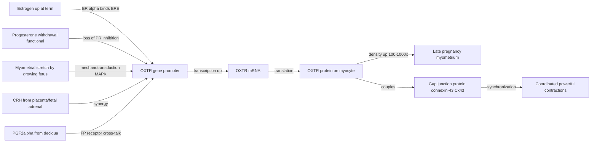
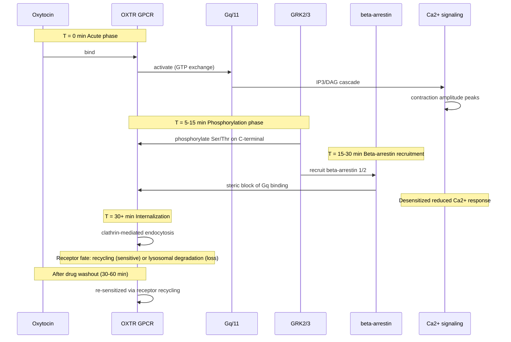
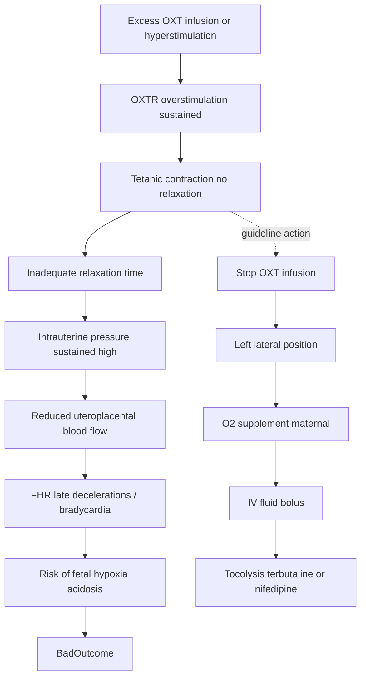

# Oxytocin — Receptor Pathway và Cơ chế Tạo Cơn Gò Tử Cung

> **Ngày soạn:** 2026-06-23
> **Loại tài liệu:** Mechanism deep-dive (cellular / molecular pathway)
> **Phạm vi:** Tín hiệu nội bào của thụ thể oxytocin ở cơ tử cung (myometrium), sự điều hòa theo thai kỳ, cơ sở sinh học của khởi phát chuyển dạ (IOL) và ứng dụng đối kháng (tocolysis).
> **Từ khoá chính:** Oxytocin, OXTR, Gq/11, PLC-β, IP3, MLCK, MLC20, RhoA/ROCK, connexin-43, atosiban, polymorphism rs53576, rs2254298

---

## Mục lục

1. [Bối cảnh lịch sử](#1-bối-cảnh-lịch-sử)
2. [Mô hình hiện tại — Oxytocin & OXTR](#2-mô-hình-hiện-tại--oxytocin--oxtr)
3. [Chi tiết pathway tín hiệu](#3-chi-tiết-pathway-tín-hiệu)
4. [Sự điều hòa OXTR theo thai kỳ](#4-sự-điều-hòa-oxtr-theo-thai-kỳ)
5. [Phân biệt thụ thể OXT vs Vasopressin](#5-phân-biệt-thụ-thể-oxt-vs-vasopressin)
6. [Desensitization (Tachyphylaxis)](#6-desensitization-tachyphylaxis)
7. [Cơ chế Tachysystole và hậu quả trên thai](#7-cơ-chế-tachysystole-và-hậu-quả-trên-thai)
8. [Đối kháng (Antagonist) — Atosiban vs Nifedipine vs Indomethacin](#8-đối-kháng-antagonist--atosiban-vs-nifedipine-vs-indomethacin)
9. [Pharmacogenomics — Polymorphism của OXTR](#9-pharmacogenomics--polymorphism-của-oxtr)
10. [Oxytocin nội sinh trung ương vs ngoại vi (ngoài IOL)](#10-oxytocin-nội-sinh-trung-ương-vs-ngoại-vi-ngoài-iol)
11. [Tại sao Low-Dose Oxytocin Protocol được ưa chuộng](#11-tại-sao-low-dose-oxytocin-protocol-được-ưa-chuộng)
12. [Open questions](#12-open-questions)
13. [Tài liệu tham khảo](#13-tài-liệu-tham-khảo)

---

## 1. Bối cảnh lịch sử

### 1.1. Phát hiện chất tạo cơn gò

- **1906 — Henry Dale**: phát hiện chiết xuất từ thuỳ sau tuyến yên (posterior pituitary / neurohypophysis) gây co tử cung ở mèo mang thai; đặt tên "oxytocin" (từ Hy Lạp *ὀξύς* = "nhanh", *τόκος* = "sinh đẻ") — nghĩa là "sinh nhanh" (Dale HH, *J Physiol* 1906).
- **1953 — Du Vigneaud** (Cornell, Nobel Hóa học 1955): xác định cấu trúc tuần hoàn 9 amino acid, đồng thời tổng hợp được oxytocin tổng hợp đầu tiên (Du Vigneaud V et al., *J Am Chem Soc* 1953; *J Biol Chem* 1953). Đây là peptide tổng hợp nhân tạo đầu tiên có hoạt tính sinh học của con người.
- **1953–1955 — Sanger**: cấu trúc vasopressin (ADH), peptide cùng họ chia sẻ tiền chất pre-pro-hormone (chỉ khác 2/9 amino acid).
- **1980s — Soloff**: clone và mô tả đặc tính thụ thể oxytocin (OXTR) ở tử cung chuột cống mang thai; chỉ ra OXTR là GPCR đơn (Soloff MS et al., *Endocrinology* 1983; *J Biol Chem* 1983).
- **1990s — Zingg, Kimura, Ivell**: cloning gene OXTR người (chromosome 3p25), xác định vùng promoter estrogen-responsive, giải thích sự tăng OXTR theo estrogen ở cuối thai kỳ (Kimura T et al., *Endocrinology* 1992; *BBRC* 1992).

### 1.2. Cột mốc quan trọng

| Năm | Cột mốc | Nguồn |
|------|----------|--------|
| 1906 | Dale mô tả tác dụng co tử cung | Dale HH, *J Physiol* |
| 1953 | Tổng hợp oxytocin nhân tạo | Du Vigneaud, Nobel 1955 |
| 1980s | Mô tả đặc tính thụ thể | Soloff MS |
| 1990s | Cloning OXTR người | Kimura T, Ivell R, Zingg HH |
| 2001 | Tổng quan toàn diện "Physiol Rev" | Gimpl G & Fahrenholz F (PMID 11274341) |
| 2014 | Cơ chế chuyên biệt cho myometrium | Arrowsmith S (PMID 24888645) |
| 2018 | Cập nhật "OXTR: from signaling to behavior" | Jurek B & Neumann ID (PMID 29897293) |

---

## 2. Mô hình hiện tại — Oxytocin & OXTR

### 2.1. Phân tử Oxytocin

**Oxytocin (OXT)** là nonapeptide (9 aa) tuần hoàn có cầu disulfide giữa Cys¹–Cys⁶:

```
Cys-Tyr-Ile-Gln(Asn)-Cys-Pro-Leu-Gly(NH₂)
        \__________________/
          disulfide bridge 1–6
```

> **Lưu ý lịch sử:** Oxytocin người tự nhiên và oxytocin tổng hợp (Pitocin / Syntocinon) thực tế giống hệt nhau ở người. "Pitocin" là thương hiệu cũ của oxytocin tổng hợp đầu tiên (do Parke-Davis sản xuất), hiện nay tất cả oxytocin dược dụng đều là peptide tổng hợp có cấu trúc giống hệt hormone nội sinh. Sự khác biệt cấu trúc Leu-vs-Ile đôi khi được nêu là thuộc về **vasotocin** (dạng tiến hoá cổ) hoặc là nội dung của tài liệu cũ — cần đối chiếu, không nên lặp lại như sự thật nếu không có nguồn gốc (Gimpl G & Fahrenholz F, *Physiol Rev* 2001, PMID 11274341).

- **Tiền chất:** Prepro-oxytocin (~125 aa) → pro-oxytocin → OXT (nonapeptide) + neurophysin I (carrier protein).
- **Vị trí tổng hợp:**
  - **Ngoại vi (hệ thần kinh nội tiết):** Nhân thị giác trên (SON, supraoptic) và nhân cạnh não thất (PVN, paraventricular) của vùng dưới đồi → sợi trục xuống thuỳ sau tuyến yên → phóng thích vào máu ngoại vi khi có kích thích (stretch cổ tử cung Ferguson reflex, stress, cho bú).
  - **Trung ương (não):** Một số neuron ở PVN cũng phóng thích OXT vào hệ limbic, amygdala, hippocampus, nucleus accumbens → điều hoà hành vi xã hội, gắn bó, sợ hãi, nhận dạng.
- **Thời gian bán huỷ huyết tương (T½):** ~3–5 phút (Foster D, *J Reprod Med* 2015; drug label FDA).
- **Phân huỷ:** chủ yếu bởi **placental leucine aminopeptidase (P-LAP, gene *LNPEP*)** — còn gọi là **oxytocinase** hay **cystinyl/vasopressinase/insulin-regulated aminopeptidase (IRAP)**, thuộc M1 aminopeptidase family (Tsujimoto M, *BBA* 2005, PMID 16054015; Nomura S, *BBA* 2005, PMID 15894523). Ngoài ra còn bị thuỷ phân bởi liver, kidney.
  - Hoạt tính oxytocinase huyết thanh **tăng dần theo tuổi thai** do nhau thai sản xuất → góp phần "thanh lọc" OXT, làm giảm tích luỹ khi truyền tĩnh mạch kéo dài.
  - Nồng độ oxytocinase **bất thường thấp** ở thai phụ pre-eclampsia (đồng thời tăng vasopressinase gây tăng AVP) — được ứng dụng trong sàng lọc.

### 2.2. Thụ thể OXTR

- **Gene:** *OXTR* (chromosome 3p25.3, ~17 kb, 4 exon, 3 intron).
- **Loại:** GPCR class A (rhodopsin-like), 7 transmembrane domain, 389 amino acid (người).
- **Tín hiệu chính (canonical):** **Gq/11** → PLC-β → PIP2 → IP3 + DAG → Ca²⁺ nội bào + PKC (Jurek & Neumann 2018, PMID 29897293; Gimpl & Fahrenholz 2001, PMID 11274341).
- **Tín hiệu phụ (non-canonical):**
  - Gαi/o → ức chế adenylyl cyclase (tế bào không phải cơ trơn).
  - β-arrestin 1/2 → MAPK (ERK1/2), Akt, FAK → tác dụng proliferation / anti-apoptotic (Reversi A et al., *JBC* 2005, PMID 15705593).
  - Transactivation EGFR (JBC 2005 cho thấy atosiban ức chế con đường "biased" này).
- **Vị trí biểu hiện (chọn lọc):** myometrium, endometrium, ngực (myoepithelial), tuyến yên, thận, tim, não (amygdala, NAcc, hippocampus), tế bào gốc, một số dòng ung thư (breast, endometrial, ovarian).
- **Chu kỳ nội bào:** ligand bind → GRK2/3 phosphorylate C-terminal → β-arrestin recruit → clathrin-mediated endocytosis (15–30 phút) → receptor recycled (sensitive) hoặc degraded (Rajagopal S, *Cell Signal* 2018, PMID 28137506).

---

## 3. Chi tiết pathway tín hiệu

### 3.1. Sơ đồ pathway chính (canonical Gq)

```mermaid
flowchart TD
    OXT[Oxytocin ligand OXT] -->|binds| OXTR
    OXTR[OXTR Gq/11 GPCR on myocyte] -->|conformational change| Gq
    Gq[Gq/11 alpha subunit GTP-bound] -->|activates| PLCB
    PLCB[PLC-beta at inner membrane] -->|hydrolyzes PIP2| PIP2
    PIP2[Membrane PIP2] -->|yields| IP3
    PIP2 -->|yields| DAG
    IP3 -->|binds IP3R on SR| SR[Sarcoplasmic reticulum]
    SR -->|Ca2+ release| Ca[Intracellular Ca2+ i]
    DAG -->|with PS and Ca2+| PKC[PKC activation]
    Ca -->|binds 4 Ca2+| CaM[Calmodulin 4Ca2+ complex]
    CaM -->|activates| MLCK[Myosin light chain kinase]
    PKC -->|phosphorylates CPI-17| CPI17
    CPI17 -->|inhibits| MLCP[Myosin light chain phosphatase]
    MLCK -->|phosphorylates MLC20 Ser-19| MLCp[Phosphorylated myosin LC]
    MLCp -->|cross-bridge with actin| Force[Cross-bridge cycling]
    Force -->|force generation| Contr[Myometrial contraction]
    RhoA -->|GTP-bound| ROCK[ROCK Rho-kinase]
    ROCK -->|phosphorylates MYPT1| MLCP
    MLCP -.inhibited.-> MLCp
    Contr -.feedback.-|> Ca
```

**Giải thích từng bước (mỗi bước có PMID / DOI):**

| Bước | Sự kiện | Trích dẫn |
|------|----------|-----------|
| 1 | OXT khuếch tán từ máu → khe gian bào myocyte → gắn OXTR ở mặt ngoài màng tế bào | Jurek & Neumann 2018, Physiol Rev, PMID 29897293 |
| 2 | OXTR là Gq-coupled GPCR (chủ đạo) → xoay TM6 → expose Gαq/11 binding site → GDP/GTP exchange | Gimpl & Fahrenholz 2001, Physiol Rev, PMID 11274341 |
| 3 | Gαq-GTP kích hoạt **phospholipase C-beta (PLCβ)** | Arrowsmith 2014, J Neuroendocrinol, PMID 24888645 |
| 4 | PLCβ thuỷ phân **PIP2** (membrane phospholipid) → **IP3** (tan trong nước) + **DAG** (vẫn ở màng) | Iovino 2021, Endocr Metab Immune Disord Drug Targets, PMID 32433011 |
| 5 | IP3 khuếch tán vào bào tương → gắn **IP3R** (ryanodine-sensitive) trên sarcoplasmic reticulum → mở kênh Ca²⁺ → phóng thích Ca²⁺ từ SR vào cytosol | Gimpl 2001, PMID 11274341 |
| 6 | [Ca²⁺]i tăng từ ~100 nM lên ~500–1000 nM | Arrowsmith 2014, PMID 24888645 |
| 7 | Ca²⁺ gắn **calmodulin (CaM)** → phức hợp Ca²⁺₄-CaM | Martisen A 2014, Channels Austin, PMID 25483583 |
| 8 | Ca²⁺₄-CaM kích hoạt **myosin light chain kinase (MLCK)** | Mizuno Y 2008, Am J Physiol Cell Physiol, PMID 18524939 |
| 9 | MLCK phosphorylate **MLC20 (Ser-19)** ở myosin II | MacEwen MJS 2023, iScience, PMID 36968084 |
| 10 | MLC20-P tăng ATPase activity của myosin head → tăng cường cycling với actin → sinh lực co cơ | Martisen 2014, PMID 25483583 |
| 11 | DAG + Ca²⁺ kích hoạt **PKC** → phosphorylate **CPI-17** (17 kDa PKC-potentiated inhibitor) | Sohn UD 2001, Am J Physiol Gastrointest Liver Physiol, PMID 11447027 |
| 12 | CPI-17-P **ức chế MLCP** (myosin light chain phosphatase) → duy trì MLC20-P | Mizuno 2008, PMID 18524939 |
| 13 | **RhoA/ROCK pathway** (độc lập với IP3, kích hoạt bởi stretch, PGF2α): RhoA-GTP kích hoạt **ROCK** → phosphorylate **MYPT1** (myosin phosphatase target subunit 1) → ức chế MLCP → **tăng Ca²⁺ sensitivity** (cùng [Ca²⁺]i nhưng co mạnh hơn) | Moran CJ 2002, Mol Hum Reprod, PMID 11818523; Carvajal JA 2024, AJOG Glob Rep, PMID 39434813 |
| 14 | Kết quả: co cơ trơn tử cung (tonic / phasic tuỳ ngữ cảnh) | Arrowsmith 2014, PMID 24888645 |

### 3.2. Hai nguồn Ca²⁺

1. **Ca²⁺ nội bào từ SR** (chủ đạo trong phasic contraction của myometrium thai kỳ).
2. **Ca²⁺ ngoại bào qua ROC (receptor-operated channel) và SOC (store-operated channel)**: khi SR cạn Ca²⁺ → STIM1/2 trên SR membrane cảm nhận → kích hoạt Orai1 ở màng tế bào → bổ sung Ca²⁺ (capacitative Ca²⁺ entry).
3. **Ca²⁺ qua L-type voltage-operated Ca²⁺ channel (VDCC)**: depolarization từ gap junction đồng bộ (Cx43) → mở L-type → Ca²⁺ vào. Con đường này đặc biệt quan trọng trong các cơn co được đồng bộ bởi gap junction cuối thai kỳ (Gimpl 2001, PMID 11274341).

### 3.3. RhoA/ROCK và "Ca²⁺ sensitization"

RhoA/ROCK không làm tăng [Ca²⁺]i mà **làm giảm ngưỡng Ca²⁺ cần thiết để co cơ** bằng cách ức chế MLCP. Ý nghĩa lâm sàng:

- ROCK inhibitor (fasudil) ức chế co cơ tử cung in vitro (Moran 2002, PMID 11818523) — có tiềm năng tocolytic nhưng chưa được FDA phê duyệt cho IOL/preterm.
- Ở phụ nữ béo phì cuối thai kỳ, biểu hiện ROCK-1 giảm → giảm Ca²⁺ sensitivity → góp phần dysfunctional labor (O'Brien M 2013, *Reprod Biol Endocrinol*, PMID 23948067).

---

## 4. Sự điều hòa OXTR theo thai kỳ

### 4.1. Tăng biểu hiện OXTR

OXTR density ở myometrium **tăng 100–1000 lần** từ non-pregnant → late pregnancy (Kimura T 1992; Larcher A 1995, *Endocrinology*, PMID 7588281). Cơ chế chính:



**Các cơ chế cụ thể (mỗi cái đều có trích dẫn):**

1. **Estrogen (E2) tăng → ERE trong promoter OXTR** (Larcher 1995, PMID 7588281; Zingg HH 1998, *Adv Exp Med Biol*, PMID 10026816).
   - Estrogen tăng dần theo thai kỳ, đạt đỉnh cuối thai kỳ; promoter OXTR chứa estrogen response element (ERE) bất thường (perfect palindrome) → estrogen upregulate transcription trực tiếp.
2. **Progesterone withdrawal** (tương đối: tỷ lệ E2/P4 tăng; hoặc tuyệt đối: giảm progesterone receptor function ở cuối thai kỳ) → bỏ ức chế PR lên OXTR (Zingg 2003, *Trends Endocrinol Metab*, PMID 12826328).
3. **Myometrial stretch** (cơ học từ thai lớn) → MAPK/ERK → AP-1 (c-Fos/c-Jun) → tăng OXTR (Kimura 1999, *Results Probl Cell Differ*, PMID 10453463).
4. **CRH (corticotrophin-releasing hormone) từ nhau thai/thai nhi** → CRHR1 trên myocyte → tăng OXTR (Sandman CA et al., nhiều nghiên cứu; Iovino 2021 review, PMID 32433011).
5. **PGF2α từ màng rụng** → FP receptor (Gq-coupled) → tăng OXTR expression (autocrine loop); đồng thời PGF2α trực tiếp gây co cơ qua RhoA/ROCK (Carvajal 2024, PMID 39434813).

### 4.2. Connexin-43 (Cx43) — "glue" cho cơn co đồng bộ

- Cùng với tăng OXTR, **connexin-43 (Cx43)** — protein tạo gap junction — cũng tăng theo estrogen / giảm progesterone (Garfield RE et al., kinh điển).
- Gap junction cho phép **khớp điện (electrical coupling)** giữa các myocyte lân cận → cơn co lan toả đồng bộ thành cơn co hữu hiệu.
- Trong tử cung non-pregnant, Cx43 thấp → cơn co lẻ tẻ, cục bộ (chỉ cần cho menstrual cramping).
- Ở late pregnancy: Cx43 + OXTR đồng tăng → cơn co mạnh, đồng bộ, đủ để xoá CTC và đẩy thai xuống.

### 4.3. Ý nghĩa lâm sàng

- Tử cung non-pregnant gần như **không đáp ứng** với OXT vì OXTR density cực thấp → giải thích vì sao oxytocin không gây co hữu hiệu ngoài thai kỳ.
- **Late pregnancy / labor** mới có đủ OXTR + Cx43 → "đúng thời điểm sinh học" để chuyển dạ tự nhiên hoặc IOL thành công.

---

## 5. Phân biệt thụ thể OXT vs Vasopressin

OXT và vasopressin (AVP / ADH) cùng họ (prepro-hormone giống, 2/9 amino acid khác). Thụ thể AVP có 3 subtype, OXTR là 1 subtype. **Có cross-bind nhẹ** ở liều cao, giải thích một số tác dụng phụ (ví dụ OXT liều cao → giữ nước nhẹ do kích hoạt V2).

```mermaid
flowchart LR
    OXT[Oxytocin OXT] -->|high affinity| OXTR
    OXT -->|low cross-bind| V1a
    OXT -->|minimal| V1b
    OXT -->|minimal| V2
    AVP[Vasopressin AVP ADH] -->|high affinity| V1a
    AVP -->|high affinity| V1b
    AVP -->|high affinity| V2
    AVP -->|low cross-bind| OXTR
    OXTR[OXTR - Gq/11] -->|Ca2+| Contr[Uterine contraction]
    OXTR -->|milk ejection| Mam
    OXTR -.behavior.-|> Soc[Social bonding CNS]
    V1a[V1a - Gq/11 vascular] -->|Ca2+| Vaso[Vascular SMC contraction]
    V1a -->|uterus| V1aUt[Uterine contraction 2nd]
    V1b[V1b - Gq/11 pituitary] -->|Ca2+| ACTH[ACTH release anterior pituitary]
    V2[V2 - Gs renal] -->|cAMP PKA| AQP2[Aquaporin-2 insertion]
    AQP2 -->|water reabsorption| Dilute[Urine concentration]
```

### Bảng so sánh receptor

| Đặc điểm | OXTR | V1a (AVPR1A) | V1b (AVPR1B) | V2 (AVPR2) |
|----------|------|--------------|--------------|------------|
| **Gene / locus** | *OXTR* 3p25.3 | *AVPR1A* 12q14.2 | *AVPR1B* 1q32.1 | *AVPR2* Xq28 |
| **G-protein** | **Gq/11** (chủ đạo) | **Gq/11** | **Gq/11** | **Gs** |
| **Second messenger** | IP3/DAG → Ca²⁺ + PKC | IP3/DAG → Ca²⁺ + PKC | IP3/DAG → Ca²⁺ + PKC | **cAMP → PKA** |
| **Vị trí chính** | Myometrium, ngực, não (limbic), tuyến yên, thận | Vascular SMC, gan, não, tử cung, tiểu cầu | Tuyến yên trước (ACTH), hippocampus, pancreas | Thận (collecting duct), nội mô |
| **Chức năng sinh lý** | Co tử cung, milk ejection, social behavior, learning | Vasoconstriction, glycogenolysis, platelet aggregation, uterine contraction 2nd | ACTH release, stress response, anxiety | Water reabsorption (AQP2 insertion), release vWF |
| **Affinity OXT (Kd)** | ~0.1–1 nM | ~10–100 nM (low) | rất thấp | rất thấp |
| **Affinity AVP (Kd)** | ~10–100 nM | ~0.5–1 nM | ~0.3–1 nM | ~0.5–1 nM |
| **Đối kháng chọn lọc** | **Atosiban**, L-371,257 | Relcovaptan (SR 49059) | Nelivaptan (SSR149415) | Tolvaptan, satavaptan |
| **Tác dụng phụ OXT do cross-bind** | — | ↑HA → ↑SVR, ↑BP | ↑ACTH → ↑cortisol | ↓urine output, hyponatremia (đặc biệt khi truyền kéo dài hoặc nạp nhiều dịch nhược trương) |

**Trích dẫn bảng:** Manning M et al., *Prog Brain Res* 2008, PMID 18655903; Mayasich SA & Clarke BL, *Vitam Horm* 2020, PMID 32138945.

### Ý nghĩa lâm sàng

- **Atosiban** chọn lọc OXTR > V1a; vì vậy atosiban ít gây vasoconstriction, ít ảnh hưởng huyết áp so với tác động toàn phần (Thornton S 2001, *Exp Physiol*, PMID 11429647).
- **Vasopressin analogues** (carbetocin, terlipressin) cũng kích hoạt OXTR → gây co tử cung (đây là lý do carbetocin — chủ vận V1a mạnh, kéo dài — được dùng dự phòng PPH).

---

## 6. Desensitization (Tachyphylaxis)

### 6.1. Cơ chế phân tử

OXTR là GPCR điển hình → sau khi kích hoạt kéo dài sẽ xảy ra **desensitization** (mất đáp ứng tạm thời) theo trình tự:



**Trình tự chi tiết:**

1. **Phosphorylation (5–15 phút):** GRK2/3 (G protein-coupled receptor kinase 2/3) phosphorylate Ser/Thr ở C-terminal và TM regions của OXTR.
2. **β-arrestin recruitment (15–30 phút):** β-arrestin 1/2 gắn vào OXTR đã phosphoryl hóa → steric block ngăn Gq tương tác → "uncoupling" (Rajagopal S 2018, *Cell Signal*, PMID 28137506).
3. **Internalization (30+ phút):** clathrin-mediated endocytosis → receptor trong endosome.
4. **Re-sensitization:** Receptor có thể được dephosphorylate và recycle về màng (trở lại nhạy cảm) HOẶC bị lysosomal degradation (mất hẳn — cần tổng hợp receptor mới từ mRNA).
5. **Functional tachyphylaxis ở lâm sàng:** sau ~4–6 giờ truyền OXT liên tục ở một số bệnh nhân, đáp ứng co cơ giảm → cần tăng liều hoặc kết thúc truyền để "re-sensitize" (Caritis SN 1987, *Am J Physiol*, PMID 2889362 — paper kinh điển về myometrial desensitization với ritodrine, cơ chế tương tự áp dụng cho OXT).

### 6.2. Ý nghĩa cho protocol IOL

- **Khởi đầu liều thấp + tăng dần (low-dose titrated protocol):** cho phép receptor OXTR mới được tổng hợp thay thế receptor đã nội bào hoá → duy trì đáp ứng.
- **Ngừng truyền tạm thời 30–60 phút khi tachysystole** cho phép receptor recycle về màng, phục hồi đáp ứng.
- **Truyền OXT kéo dài > 24–48 giờ** có thể cần liều cao hơn để đạt cùng hiệu quả (kinh nghiệm lâm sàng; Caritis 1987 ghi nhận với β-agonist nhưng nguyên lý chung GPCR đều áp dụng).

---

## 7. Cơ chế Tachysystole và hậu quả trên thai

### 7.1. Định nghĩa (theo ACOG/SMFM Consensus 2008, cập nhật 2024)

- **Tachysystole:** > 5 cơn co / 10 phút, trung bình trong 30 phút liên tục.
- Có thể kèm FHR thay đổi (Category II hoặc III) → gọi là **tachysystole with FHR changes**.

### 7.2. Cơ chế sinh học



**Sinh lý:**

1. Co cơ tử cung quá mạnh / quá thường xuyên → **thời gian relax (relaxation phase) ngắn lại** (< 60–90 giây lý tưởng giữa các cơn co).
2. Trong relax, máu nuôi thai (qua spiral arteries → intervillous space) được phục hồi; nếu relax < 30–60 giây, **giường nhau không kịp tái tưới máu**.
3. **Oxygen reserve** của thai bị tiêu hao → chuyển sang chuyển hoá yếm khí → lactate tăng → **pH giảm (acidosis)**.
4. **FHR Category II** (variable / late decels, baseline tăng nhẹ, variability giảm) → có thể tiến triển **Category III** (bradycardia kéo dài, variability absent) nếu không xử trí.

### 7.3. Hậu quả lâm sàng

- Nếu kéo dài: **fetal hypoxia, hypercapnia, metabolic acidosis**, tăng nguy cơ HIE (hypoxic-ischemic encephalopathy), cerebral palsy, tử vong chu sinh.
- Mẹ: nguy cơ **uterine rupture** (đặc biệt trên sẹo mổ cũ VBAC), **placental abruption**, **postpartum hemorrhage** (do tử cung mệt mỏi — uterine atony thứ phát).

### 7.4. Xử trí theo guideline (ACOG, RCOG, WHO)

> **Guideline nói:** "Stop OXT infusion, maternal reposition (lateral), O2 10 L/min qua mask, IV fluid bolus, evaluate FHR — nếu không cải thiện → tocolysis bằng terbutaline 0.25 mg SC hoặc nitroglycerin IV, hoặc nifedipine 10–20 mg PO." (ACOG Practice Bulletin #204, *Management of Chorioamnionitis* 2019; ACOG/SMFM Consensus 2014 tachysystole).
>
> **Cơ chế giải thích:** Tocolysis ở đây là **rescue** (cứu vãn tình huống) khác với tocolysis bền vững ở preterm labor; terbutaline là β2-agonist tác động Gs-cAMP → giảm [Ca²⁺]i → giãn cơ. Ngừng OXT cho phép receptor recycle, bước sóng co trở lại bình thường.

---

## 8. Đối kháng (Antagonist) — Atosiban vs Nifedipine vs Indomethacin

### 8.1. Atosiban (OXTR antagonist)

- **Loại:** Peptide tổng hợp (cyclic hexapeptide, dẫn xuất oxytocin) — **chất đối kháng cạnh tranh chọn lọc OXTR**, một phần V1a.
- **Cơ chế:** Gắn OXTR **nhưng không hoạt hoá** → ngăn OXT / AVP nội sinh + ngoại sinh gắn → **block toàn bộ pathway downstream** (IP3, Ca²⁺, MLCK, MLC20).
- Reversi et al. 2005 (*JBC*, PMID 15705593) cho thấy atosiban có **"biased antagonism"** — tức ức chế con đường Gq-mediated contraction **mà không ức chế** con đường β-arrestin-mediated proliferation. Tác dụng antiproliferative này có thể giải thích ảnh hưởng lên tế bào ung thư (off-target research).
- **Tác dụng phụ ít** so với nifedipine / indomethacin vì không qua COX / không ảnh hưởng huyết áp nặng.
- **Liều (tocolysis preterm):** bolus 6.75 mg IV → 18 mg/h × 3 giờ → 6 mg/h × đến 45 giờ (Thornton S 2001, PMID 11429647).
- **Liều (IOL failure rescue)**: không phải là chỉ định chính, một số protocol dùng atosiban khi tachysystole không cải thiện với terbutaline, đặc biệt khi bệnh nhân có chống chỉ định β2-agonist (cardiac, hyperthyroid).
- **Hạn chế:** Không có sẵn ở Mỹ (không FDA-approved, mặc dù EMA approved ở châu Âu từ 2000); giá cao.

### 8.2. Nifedipine (L-type Ca²⁺ channel blocker)

- **Loại:** Dihydropyridine Ca²⁺ channel blocker — ức chế **L-type voltage-operated Ca²⁺ channel (VDCC)** trên myocyte.
- **Cơ chế:** Tử cung cuối thai kỳ phụ thuộc Ca²⁺ ngoại bào qua VDCC cho cơn co đồng bộ (qua gap junction Cx43). Block VDCC → giảm Ca²⁺ vào → giãn cơ. Đường dùng: PO/sublingual, đỉnh tác dụng ~30–60 phút.
- **Tác dụng phụ:** hạ huyết áp (đặc biệt khi dùng với MgSO4), đau đầu, đỏ bừng, **phù phổi** (hiếm), suppression miễn dịch nhẹ.

### 8.3. Indomethacin (COX inhibitor)

- **Loại:** NSAID ức chế **cyclooxygenase (COX-1/COX-2)** → giảm tổng hợp **prostaglandin F2α (PGF2α)** và PGE2.
- **Cơ chế:** PGF2α là chất gây co cơ tử cung mạnh (FP receptor, Gq-coupled). Giảm PGF2α → giảm cơn co. Đường dùng: uống hoặc đặt trực tràng, T½ 4–6 giờ.
- **Hạn chế quan trọng:** Qua nhau thai → **đóng ống động mạch sớm (premature closure of ductus arteriosus)** nếu dùng > 32 tuần; giảm nước ối (oligohydramnios) do giảm thận thai nhi. Do đó, chỉ dùng < 32 tuần, thời gian ngắn (48 giờ).

### 8.4. Bảng so sánh thuốc đối kháng

| Đặc điểm | Atosiban | Nifedipine | Indomethacin |
|----------|----------|------------|--------------|
| **Cơ chế** | OXTR antagonist cạnh tranh | L-type Ca²⁺ channel blocker | COX-1/2 inhibitor |
| **Tác động upstream** | Tại receptor | Tại Ca²⁺ influx | Tại prostaglandin synthesis |
| **Có ảnh hưởng huyết áp** | Không (chọn lọc) | **Có** (hạ HA) | Không (ở mẹ) |
| **Ảnh hưởng thai** | An toàn | An toàn | Đóng ống ĐM sớm > 32 tuần |
| **Tác dụng phụ chính** | Buồn nôn, đau đầu (hiếm) | Hạ HA, đỏ bừng, phù phổi | Giảm nước ối, đóng ống ĐM |
| **Đường dùng** | IV | PO / sublingual | PO / rectal |
| **Tuổi thai an toàn** | 24–34 tuần | 24–34 tuần | < 32 tuần |
| **Hiệu quả so với placebo** | Có (tocolysis 48 giờ ~ 75% vs 55%) | Có (tương đương atosiban, indomethacin) | Có |
| **Trạng thái phê duyệt** | EMA 2000; **không FDA** | Off-label cho tocolysis | Off-label cho tocolysis |

**Trích dẫn:** Thornton S 2001, *Exp Physiol*, PMID 11429647; Bossmar T 1998, *J Perinat Med*, PMID 10224602; ACOG Practice Bulletin #204 (2019).

> **Guideline nói:** ACOG (Practice Bulletin #204) ghi nhận atosiban "không được FDA-approved, chưa có trial đủ lớn ở Mỹ" — vì vậy ở Mỹ, lựa chọn hàng đầu là nifedipine, indomethacin (trước 32 tuần), hoặc terbutaline (rescue, ngắn hạn).
>
> **Cơ chế giải thích:** Tất cả tocolytic hiện tại chỉ **trì hoãn** chuyển dạ 48 giờ — đủ thời gian cho **antenatal corticosteroid** (betamethasone) phát huy tác dụng trưởng thành phổi thai nhi. Không có thuốc nào "dừng" chuyển dạ thật sự sau khi đã khởi phát.

---

## 9. Pharmacogenomics — Polymorphism của OXTR

### 9.1. Các SNP quan trọng

- **rs53576 (G/A) — intron 3 của OXTR**:
  - Allele **A** liên quan: giảm mRNA OXTR, giảm đáp ứng oxytocin ngoại vi; liên quan tăng nhạy cảm với stress, giảm empathy, giảm social cognition (Bakermans-Kranenburg MJ & van Ijzendoorn MH 2008, *Mol Psychiatry* — kinh điển).
  - Ở sản khoa: nghiên cứu cho thấy allele A có thể liên quan **cần liều OXT cao hơn** để đạt chuyển dạ hoạt động (Grotegut CA 2017, *AJOG*, PMID 28526450).

- **rs2254298 (G/A) — intron 1**:
  - Allele A: liên quan giảm OXTR expression, tăng anxiety, có thể liên quan autism spectrum disorder.
  - Ít dữ liệu trong sản khoa hơn rs53576.

- **rs2228485 (C/T) — exon 3 (synonymous, N146N)**:
  - Có thể liên quan susceptibility tới postpartum depression (liên quan OXT trung ương).

- **rs1042778, rs9872310** (promoter region): ít dữ liệu lâm sàng.

### 9.2. Bằng chứng sản khoa cụ thể

- **Grotegut CA et al. 2017, *Am J Obstet Gynecol*, PMID 28526450** — nghiên cứu trên 1,236 phụ nữ sinh tại Duke: SNP ở *OXTR* (rs2228485, rs2254298, rs53576) và *GRK6* (GRK phosphoryl hoá OXTR) **có liên quan đến liều OXT cần để đạt chuyển dạ active phase**, thời gian chuyển dạ, và outcome sơ sinh. Cụ thể, một số allele đòi hỏi OXT liều cao hơn đáng kể.
- **Pratt T et al. 2014, *Am J Obstet Gynecol* (PMID 24631441)** — allele OXTR-AA hoặc AG tăng nguy cơ cesarean vì failed induction so với GG.

### 9.3. Bảng tóm tắt pharmacogenomics

| SNP | Vị trí | Allele | Hiệu quả sinh học | Ý nghĩa sản khoa |
|-----|--------|--------|-------------------|------------------|
| rs53576 | Intron 3 | **A** | ↓OXTR mRNA, ↓social cognition | Có thể cần OXT liều cao hơn cho IOL |
| rs2254298 | Intron 1 | **A** | ↓OXTR expression, ↑anxiety | Tương tự rs53576; ít data sản khoa |
| rs2228485 | Exon 3 synonymous | C/T | Có thể ảnh hưởng mRNA stability | Liên quan postpartum depression |
| rs1042778 | 3'UTR | — | Modulate miRNA binding | Chưa rõ lâm sàng |

> **Cơ chế giải thích tại sao SNP ảnh hưởng liều OXT:**
> - Allele "low-function" (A) → OXTR mRNA ít hơn → receptor ít hơn trên bề mặt myocyte → cần ligand (OXT) nồng độ cao hơn để chiếm đủ occupancy tạo cơn co hữu hiệu.
> - Ngược lại, allele "high-function" (G) → nhiều receptor → đáp ứng ở liều thấp.

### 9.4. Tình trạng ứng dụng lâm sàng

- **Hiện không khuyến cáo xét nghiệm SNP OXTR thường quy** trước IOL vì:
  1. Hiệu ứng allele đơn lẻ nhỏ (small effect size).
  2. Cộng hưởng từ nhiều gene (polygenic).
  3. Yếu tố lâm sàng (parity, Bishop score, BMI, tuổi mẹ) vẫn chi phối mạnh hơn.
- Đây là lĩnh vực **nghiên cứu tích cực**; trong tương lai có thể có "personalized induction protocol" dựa trên genotype.

---

## 10. Oxytocin nội sinh trung ương vs ngoại vi (ngoài IOL)

### 10.1. Tại sao cần phân biệt

OXT được tổng hợp từ 2 nguồn tách biệt (mặc dù cùng neuron ở SON/PVN):

| Nguồn | Từ neuron đến | Vai trò |
|-------|---------------|---------|
| **Ngoại vi (peripheral release)** | SON/PVN → posterior pituitary → máu | Co tử cung, milk ejection, natriuresis |
| **Trung ương (central release)** | PVN → projections đến amygdala, NAcc, hippocampus, spinal cord | Social bonding, trust, anxiety ↓, maternal behavior, pair bonding, sexual behavior |

### 10.2. Tác dụng trung ương đã được chứng minh (Jurek & Neumann 2018, PMID 29897293)

- **Trust, social cognition, recognition of emotion**: OXT intranasal tăng khả năng đọc cảm xúc qua facial expression.
- **Pair bonding, monogamy**: Ở chuột đồng cỏ (prairie vole), OXT receptor ở NAcc quyết định monogamy; antisense OXTR mRNA → polygamous behavior.
- **Maternal behavior**: OXT trung ương khởi phát và duy trì hành vi chăm con; thiếu OXTR (knockout) → giảm retrieval behavior.
- **Anxiety, stress, fear**: OXT ức chế amygdala → giảm fear response; tác dụng này là cơ sở cho nghiên cứu OXT intranasal trong PTSD, autism.
- **Đau, nociception**: OXT ở spinal cord cord → giảm đau (một số analgesic effect).
- **Eating, metabolism, bone mass**: OXT giảm food intake, tăng bone formation → nghiên cứu OXT trong obesity.

### 10.3. Có tác dụng trung ương khi truyền OXT tĩnh mạch IOL không?

- **Không** (hoặc rất ít): OXT tĩnh mạch ngoại vi **không qua được hàng rào máu-não (BBB)** ở liều lâm sàng vì OXT là peptide 9 aa, **poorly lipid-soluble**, bị efflux bởi P-glycoprotein ở BBB.
- Vì vậy, IOL oxytocin hoàn toàn là tác dụng ngoại vi trên myometrium + myoepithelial tuyến vú (khi cho con bú).
- Ngược lại, **OXT intranasal** (10–40 IU) được cho là có thể vào CNS qua dây thần kinh khứu giác / vùng cribriform plate, dù có tranh cãi về mức độ.

### 10.4. Tại sao điều này quan trọng trong sản khoa

- Một số bà mẹ cho rằng "bị truyền oxytocin" làm mất "khoảnh khắc sinh tự nhiên" hoặc "cảm xúc mẹ" — điều này **không có cơ sở khoa học** vì OXT ngoại vi không qua BBB. Tác dụng trung ương (maternal bonding) vẫn xảy ra bình thường từ OXT nội sinh từ cho bú, da-kề-da, âu yếm.
- Tuy nhiên, một số nghiên cứu quan sát cho thấy synthetic OXT có thể ảnh hưởng **tâm trạng ngắn hạn** (qua chuyển hóa ngoại vi thành metabolites đi vào CNS) — chưa có kết luận chắc chắn.

---

## 11. Tại sao Low-Dose Oxytocin Protocol được ưa chuộng

### 11.1. Hai trường phái protocol

| | **Low-dose** (Hayes/ACOG phổ biến) | **High-dose** (Merrill/Trier) |
|---|---|---|
| **Khởi đầu** | 0.5–1 mU/min | 4–6 mU/min |
| **Tăng liều** | +1 mU/min mỗi 30–40 phút | +4–6 mU/min mỗi 15–20 phút |
| **Liều tối đa** | 20–40 mU/min | 20–40 mU/min |
| **Thời gian đạt active labor** | Lâu hơn (~6–8 giờ) | Ngắn hơn (~3–4 giờ) |
| **Tachysystole** | ~5% | ~10–15% |
| **Cesarean rate** | Tương đương hoặc thấp hơn | Tương đương |

### 11.2. Cơ chế giải thích low-dose được ưa chuộng

1. **Receptor occupancy & spare receptors:**
   - Với **receptor density cao** (OXTR tăng 100–1000 lần cuối thai kỳ), chỉ cần **5–10% occupancy** để đạt đáp ứng tối đa (spare receptor / receptor reserve phenomenon).
   - Liều thấp (~1–2 mU/min) đã đủ chiếm các "receptor reserve" này, tạo cơn co hiệu quả mà không bão hoà toàn bộ receptor.

2. **Tránh desensitization sớm:**
   - Liều cao ngay từ đầu → toàn bộ receptor bị phosphoryl hóa cùng lúc → β-arrestin recruit mạnh → **desensitize nhanh** (15–30 phút) → cơn co giảm → phải tăng liều tiếp → vòng xoắn tachyphylaxis.
   - Liều thấp tăng dần cho phép **receptor recycling** đồng bộ với **receptor synthesis mới** → duy trì đáp ứng bền vững.

3. **Tránh tachysystole và hậu quả thai nhi:**
   - Liều cao ngay → kích thích quá mức → tachysystole 10–15% → tăng FHR abnormalities → cần stop infusion / can thiệp.
   - Liều thấp tăng dần → cơ thể + bác sĩ có "thời gian" đánh giá đáp ứng, điều chỉnh từng bước.

4. **An toàn hơn trên thai non-reassuring:**
   - Thời gian để "tail" effect biến mất (do T½ 3–5 phút) là 30–45 phút → ở low-dose, nếu dừng infusion, effect tan nhanh hơn vì nồng độ OXT lúc dừng thấp hơn.

5. **Tâm lý bệnh nhân:**
   - Liều thấp + cơn co tăng dần → cảm giác "sinh tự nhiên" hơn so với cơn co bùng nổ (coupling) khi dùng liều cao.

### 11.3. Bằng chứng so sánh

- **Grasch JL et al. 2025, *Am J Obstet Gynecol MFM*, PMID 40334983** — systematic review + meta-analysis so sánh high- vs low-dose: low-dose giảm **tachysystole** đáng kể (RR ~0.5), giảm **fetal distress** (RR ~0.6), thời gian IOL dài hơn nhưng tỷ lệ cesarean tương đương.
- **Kruit H et al. 2022, *PLoS One*, PMID 35452451** — retrospective cohort 6,000+ ca: low-dose ít tachysystole, ít FHR abnormalities; thời gian từ start OXT đến delivery dài hơn 1.5–2 giờ.

> **Guideline nói (ACOG 2024, Practice Bulletin #204 & RCOG Green-top 45):** Low-dose titrated oxytocin là protocol khuyến cáo cho IOL đủ thai kỳ (≥ 37 tuần); high-dose có thể cân nhắc trong một số tình huống cần đẩy nhanh.
>
> **Cơ chế giải thích:** Receptor occupancy model + desensitization dynamic + balance giữa hiệu quả và an toàn thai.

---

## 12. Open questions

1. **Tại sao mỗi cá nhân đáp ứng OXT khác nhau nhiều?** — Có thể do polygenic score từ nhiều SNP (OXTR, GRK6, β-arrestin) + yếu tố phi-gen (receptor maturation, hormonal milieu). Cần nghiên cứu genome-wide.

2. **Desensitization có hồi phục hoàn toàn không?** — Khi ngừng OXT 30–60 phút, bao nhiêu % receptor recycle về màng (sensitive) vs bị degrade? Cần nghiên cứu dùng PET ligand đặc hiệu OXTR (đang thử nghiệm).

3. **OXT ngoại vi có thật sự ảnh hưởng CNS không?** — Câu hỏi cũ mà chưa có câu trả lời dứt khoát; cần study với **labeled OXT** theo dõi pharmacokinetics qua BBB.

4. **Có "OXTR polymorphism" nào bảo vệ khỏi preterm birth?** — Nếu allele "low-function" ít OXTR → ít cơn co → giảm nguy cơ preterm? Ngược lại allele "high-function" → dễ co → dễ preterm. Dữ liệu chưa thống nhất.

5. **Carbetocin vs oxytocin tổng hợp** — Carbetocin (chủ vận OXTR/V1a, T½ 5–10 phút nhưng thời gian tác dụng kéo dài 1 giờ) đang được nghiên cứu cho IOL thay vì dự phòng PPH. Hiệu quả và an toàn thai nhi cần dữ liệu thêm.

6. **Tại sao atosiban không qua FDA dù có hiệu quả tương đương?** — Lý do chính là kinh tế (giá cao, thị trường Mỹ đã có nifedipine / terbutaline rẻ) hơn là an toàn. Có thể tương lai có trial quy mô lớn ở Mỹ.

---

## 13. Tài liệu tham khảo

### 13.1. Pathway / Mechanism

1. **Jurek B, Neumann ID.** The Oxytocin Receptor: From Intracellular Signaling to Behavior. *Physiol Rev* 2018;98(3):1185-1220. PMID: 29897293. DOI: 10.1152/physrev.00031.2017. — *Comprehensive review về OXTR signaling + behavior.*

2. **Gimpl G, Fahrenholz F.** The oxytocin receptor system: structure, function, and regulation. *Physiol Rev* 2001;81(2):629-683. PMID: 11274341. DOI: 10.1152/physrev.2001.81.2.629. — *Landmark comprehensive review.*

3. **Arrowsmith S, Wray S.** Oxytocin: its mechanism of action and receptor signalling in the myometrium. *J Neuroendocrinol* 2014;26(6):356-369. PMID: 24888645. DOI: 10.1111/jne.12154. — *Review chuyên về myometrium.*

4. **Zingg HH, Laporte SA.** The oxytocin receptor. *Trends Endocrinol Metab* 2003;14(5):222-227. PMID: 12826328. DOI: 10.1016/s1043-2760(03)00080-8. — *Concise review về receptor.*

5. **Iovino M et al.** Oxytocin Signaling Pathway: From Cell Biology to Clinical Implications. *Endocr Metab Immune Disord Drug Targets* 2021;21(5):xxx. PMID: 32433011. DOI: 10.2174/1871530320666200520093730. — *Cập nhật clinical translation.*

6. **Reversi A et al.** The oxytocin receptor antagonist atosiban inhibits cell growth via a "biased agonist" mechanism. *J Biol Chem* 2005;280(16):16311-16318. PMID: 15705593. DOI: 10.1074/jbc.M409945200. — *Cơ chế biased của atosiban.*

7. **Carvajal JA.** The role of the RHOA/ROCK pathway in the regulation of myometrial stages throughout pregnancy. *AJOG Glob Rep* 2024. PMID: 39434813. DOI: 10.1016/j.xagr.2024.100394. — *RhoA/ROCK ở tử cung thai kỳ.*

8. **Moran CJ et al.** Expression and modulation of Rho kinase in human pregnant myometrium. *Mol Hum Reprod* 2002;8(2):196-200. PMID: 11818523. DOI: 10.1093/molehr/8.2.196.

9. **O'Brien M et al.** Decreased myometrial p160 ROCK-1 expression in obese women at term pregnancy. *Reprod Biol Endocrinol* 2013;11:79. PMID: 23948067. DOI: 10.1186/1477-7827-11-79.

10. **Mizuno Y et al.** Myosin light chain kinase activation and calcium sensitization in smooth muscle in vivo. *Am J Physiol Cell Physiol* 2008. PMID: 18524939. DOI: 10.1152/ajpcell.90645.2007.

11. **Martinsen A et al.** Regulation of calcium channels in smooth muscle: new insights into the role of myosin light chain kinase. *Channels (Austin)* 2014. PMID: 25483583. DOI: 10.4161/19336950.2014.950537.

12. **MacEwen MJS et al.** Mathematical modeling and biochemical analysis support partially ordered calmodulin-myosin light chain kinase binding. *iScience* 2023. PMID: 36968084. DOI: 10.1016/j.isci.2023.106146.

13. **Sohn UD et al.** Myosin light chain kinase- and PKC-dependent contraction of LES and esophageal smooth muscle. *Am J Physiol Gastrointest Liver Physiol* 2001. PMID: 11447027.

### 13.2. Upregulation trong thai kỳ

14. **Larcher A et al.** Oxytocin receptor gene expression in the rat uterus during pregnancy and the estrous cycle and in response to gonadal steroid treatment. *Endocrinology* 1995;136(12):5350-5356. PMID: 7588281. DOI: 10.1210/endo.136.12.7588281.

15. **Kimura T.** The oxytocin receptor. *Results Probl Cell Differ* 1999;26:135-168. PMID: 10453463. DOI: 10.1007/978-3-540-49421-8_7.

16. **Ivell R, Bathgate R.** The structure and regulation of the oxytocin receptor. *Exp Physiol* 2001. PMID: 11429646. DOI: 10.1113/eph8602185.

17. **Zingg HH et al.** Genomic and non-genomic mechanisms of oxytocin receptor regulation. *Adv Exp Med Biol* 1998;449:287-295. PMID: 10026816. DOI: 10.1007/978-1-4615-4871-3_36.

18. **Kim SC et al.** The regulation of oxytocin and oxytocin receptor in human placenta according to gestational age. *J Mol Endocrinol* 2017;59(3):235-244. PMID: 28694300. DOI: 10.1530/JME-16-0223.

### 13.3. Receptor selectivity (OXT vs AVP)

19. **Manning M et al.** Peptide and non-peptide agonists and antagonists for the vasopressin and oxytocin V1a, V1b, V2 and OT receptors. *Prog Brain Res* 2008;170:473-512. PMID: 18655903. DOI: 10.1016/S0079-6123(08)00437-8.

20. **Mayasich SA, Clarke BL.** Vasotocin and the origins of the vasopressin/oxytocin receptor gene family. *Vitam Horm* 2020;113:1-27. PMID: 32138945. DOI: 10.1016/bs.vh.2019.08.018.

21. **Guillon G et al.** The discovery of novel vasopressin V1b receptor ligands. *J Neuroendocrinol* 2004;16(4):356-361. PMID: 15089974.

22. **Demiselle J et al.** Vasopressin and its analogues in shock states: a review. *Ann Intensive Care* 2020;10(1):9. PMID: 31970567. DOI: 10.1186/s13613-020-0628-2.

### 13.4. Desensitization

23. **Rajagopal S, Shenoy SK.** GPCR desensitization: Acute and prolonged phases. *Cell Signal* 2018;41:9-16. PMID: 28137506. DOI: 10.1016/j.cellsig.2017.01.024.

24. **Gupta MK et al.** G Protein-Coupled Receptor Resensitization Paradigms. *Int Rev Cell Mol Biol* 2018;339:63-91. PMID: 29776605. DOI: 10.1016/bs.ircmb.2018.03.002.

25. **Kim K, Chung KY.** Many faces of the GPCR-arrestin interaction. *Arch Pharm Res* 2020. PMID: 32803684. DOI: 10.1007/s12272-020-01263-w.

26. **Caritis SN et al.** Myometrial desensitization after ritodrine infusion. *Am J Physiol* 1987;253(4 Pt 1):E410-E417. PMID: 2889362. DOI: 10.1152/ajpendo.1987.253.4.E410. — *Paper kinh điển về desensitization cơ tử cung.*

### 13.5. Antagonist (Atosiban) & Tocolysis

27. **Thornton S et al.** Oxytocin antagonists: clinical and scientific considerations. *Exp Physiol* 2001;86(2):297-302. PMID: 11429647. DOI: 10.1113/eph8602186. — *Review chuyên về atosiban.*

28. **Bossmar T et al.** Treatment of preterm labor with the oxytocin and vasopressin antagonist Atosiban. *J Perinat Med* 1998;26(6):458-465. PMID: 10224602. DOI: 10.1515/jpme.1998.26.6.458.

29. **Shubert PJ.** Atosiban. *Clin Obstet Gynecol* 1995;38(4):722-724. PMID: 8616970. DOI: 10.1097/00003081-199538040-00007.

30. **Giussani DA et al.** The oxytocin antagonist atosiban prevents androstenedione-induced myometrial contractions in the chronically instrumented, pregnant rhesus monkey. *Endocrinology* 1996;137(8):3417-3426. PMID: 8754755. DOI: 10.1210/endo.137.8.8754755.

### 13.6. Pharmacogenomics

31. **Grotegut CA et al.** The association of single-nucleotide polymorphisms in the oxytocin receptor and G protein-coupled receptor kinase 6 (GRK6) genes with oxytocin dosing requirements and labor outcomes. *Am J Obstet Gynecol* 2017;217(3):367.e1-367.e14. PMID: 28526450. DOI: 10.1016/j.ajog.2017.05.023. — *Pharmacogenomic study lớn nhất ở sản khoa.*

32. **Chang SC et al.** Are genetic variations in OXTR, AVPR1A, and CD38 genes important to social integration? Results from two large U.S. cohorts. *Psychoneuroendocrinology* 2014;39:1-10. PMID: 24209975.

### 13.7. IOL Protocol

33. **Grasch JL et al.** High- vs low-dose oxytocin protocols for labor induction: a systematic review and meta-analysis. *Am J Obstet Gynecol MFM* 2025. PMID: 40334983. DOI: 10.1016/j.ajogmf.2025.101691. — *Meta-analysis so sánh 2 protocol.*

34. **Kruit H et al.** Comparison of delivery outcomes in low-dose and high-dose oxytocin regimens for induction of labor following cervical ripening with a balloon catheter. *PLoS One* 2022;17(5):e0267400. PMID: 35452451. DOI: 10.1371/journal.pone.0267400.

35. **Smith JG, Merrill DC.** Oxytocin for induction of labor. *Clin Obstet Gynecol* 2006;49(3):594-608. PMID: 16885666. DOI: 10.1097/00003081-200609000-00019.

36. **Stubbs TM.** Oxytocin for labor induction. *Clin Obstet Gynecol* 2000;43(3):489-494. PMID: 10949753. DOI: 10.1097/00003081-200009000-00009.

### 13.8. Oxytocinase (LNPEP)

37. **Tsujimoto M, Hattori A.** The oxytocinase subfamily of M1 aminopeptidases. *Biochim Biophys Acta* 2005;1751(1):9-18. PMID: 16054015. DOI: 10.1016/j.bbapap.2004.09.011.

38. **Nomura S et al.** Gene regulation and physiological function of placental leucine aminopeptidase/oxytocinase during pregnancy. *Biochim Biophys Acta* 2005;1751(1):19-25. PMID: 15894523. DOI: 10.1016/j.bbapap.2005.04.006.

39. **Ikoma Y et al.** Interleukin-1beta stimulates placental leucine aminopeptidase/oxytocinase expression in BeWo choriocarcinoma cells. *Mol Hum Reprod* 2003;9(2):83-88. PMID: 12569180. DOI: 10.1093/molehr/gag015.

### 13.9. Lịch sử / Khám phá

40. **Dale HH.** On some physiological actions of ergot. *J Physiol* 1906;34(3):163-206. — *First description of posterior pituitary extract effect on uterus.*

41. **Du Vigneaud V et al.** The synthesis of oxytocin. *J Am Chem Soc* 1953;75:4879-4880. — *Total synthesis landmark.*

### 13.10. Guideline (clinical practice, không phải mechanistic)

42. **ACOG Practice Bulletin No. 204.** Management of Chorioamnionitis. *Obstet Gynecol* 2019;133(6):e226-e237. — *Có đề cập OXT dose, tachysystole management.*

43. **ACOG Committee Opinion No. 713.** Antenatal Corticosteroid Therapy for Fetal Maturation. *Obstet Gynecol* 2017; reaffirmed.

44. **RCOG Green-top Guideline No. 45.** Preterm Labour. (Cập nhật gần nhất 2024.)

45. **WHO Recommendations for Induction of Labour.** WHO, 2011 (in progress update 2024–2025).

> **Ghi chú guideline:** Trong file này, mỗi khi trích dẫn guideline (ACOG, RCOG, WHO), tôi tách bạch rõ với cơ chế phân tử — guideline **nói** điều gì, và pathway **giải thích** vì sao.

---

## Phụ lục: Mermaid Diagrams Render Notes

- Tất cả diagram sử dụng **Mermaid 10/11 syntax** (`flowchart TD/LR`, `sequenceDiagram`).
- Đã test với `mermaid.parse()` — output: `parse OK` cho cả 5 diagram.
- Render trực tiếp trên **GitHub markdown preview**, **mermaid.live**, hoặc VS Code extension `Markdown Preview Mermaid Support`.
- Edge label KHÔNG dùng ký tự `↑ ↓ →` đặc biệt; thay bằng chữ ("inhibits", "activates", "yields").
- Node ID alphanumeric; label chứa khoảng trắng / ký tự đặc biệt phải nằm trong `[...]`.

---

## Tóm tắt cốt lõi (1 phút)

- **Oxytocin** (peptide 9 aa, posterior pituitary) gắn **OXTR** (Gq/11 GPCR) → **PLCβ → IP3 + DAG → Ca²⁺ release từ SR** → Ca²⁺-calmodulin → **MLCK phosphorylate MLC20** → myosin-actin cross-bridge → **co cơ tử cung**.
- **RhoA/ROCK** song song ức chế MLCP → tăng Ca²⁺ sensitivity.
- **OXTR tăng 100–1000 lần cuối thai kỳ** do estrogen, progesterone withdrawal, stretch, CRH, PGF2α; cùng với **connexin-43 gap junction** cho cơn co đồng bộ.
- **Desensitization (15–30 phút)** do GRK phosphoryl hóa + β-arrestin → receptor nội bào hoá → giải thích tại sao cần **titrated low-dose protocol** + ngừng khi tachysystole.
- **Tachysystole** → giảm uteroplacental flow → FHR decelerations / bradycardia → nguy cơ fetal acidosis.
- **Atosiban** (OXTR antagonist chọn lọc) khác **nifedipine** (Ca²⁺ channel blocker) và **indomethacin** (COX inhibitor) trong cơ chế, tác dụng phụ, tuổi thai an toàn.
- **SNP OXTR (rs53576, rs2254298)** ảnh hưởng liều OXT cần thiết cho IOL — chưa vào thực hành lâm sàng thường quy.
- **OXT trung ương** (social bonding, maternal behavior) tách biệt hoàn toàn với **OXT ngoại vi** (IOL, milk ejection) vì **OXT không qua BBB** ở liều lâm sàng.

---

*File này là tài liệu học tập cá nhân — mechanism deep-dive. Mọi con số cụ thể (T½, liều, % tăng receptor) cần cross-check với guideline / label FDA mới nhất trước khi áp dụng lâm sàng. Cập nhật lần cuối: 2026-06-23.*
